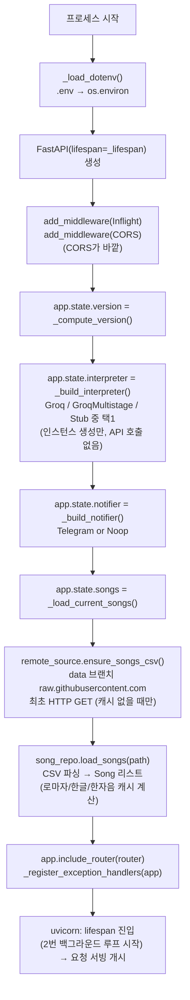
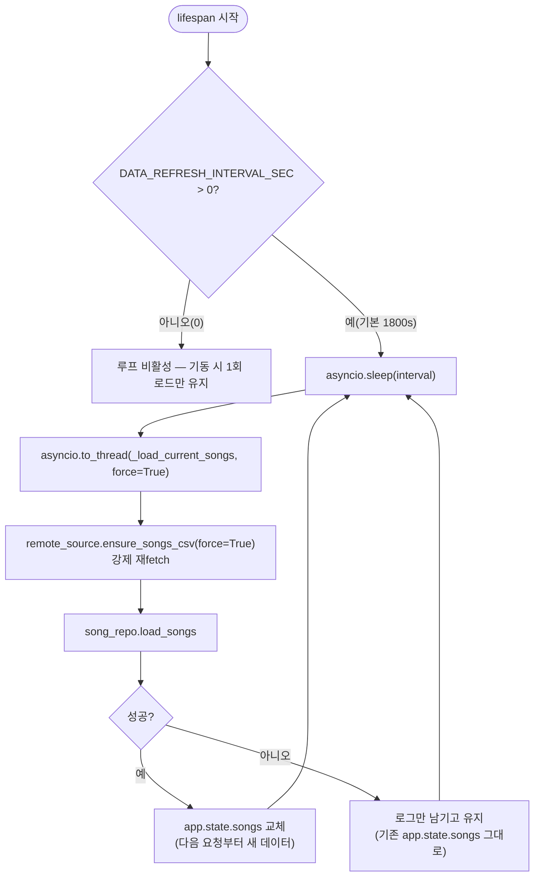
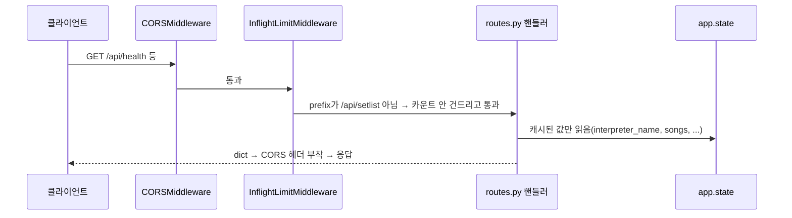
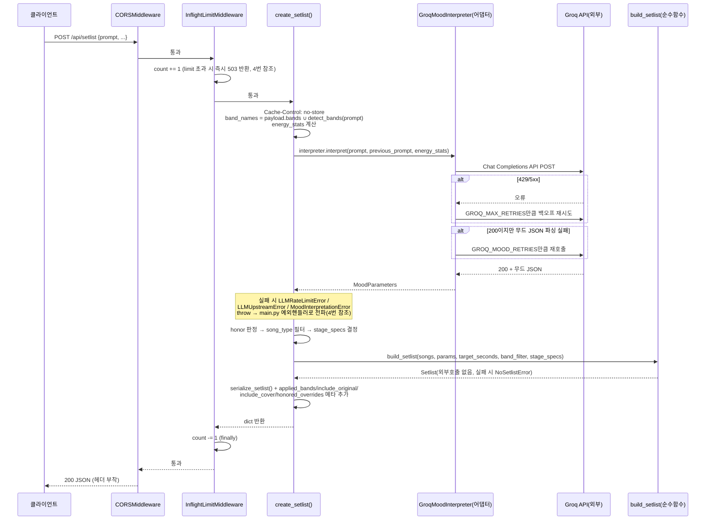
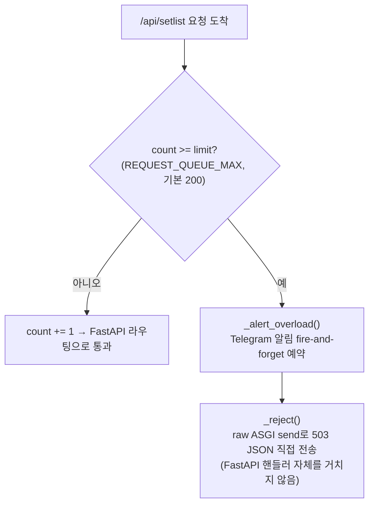
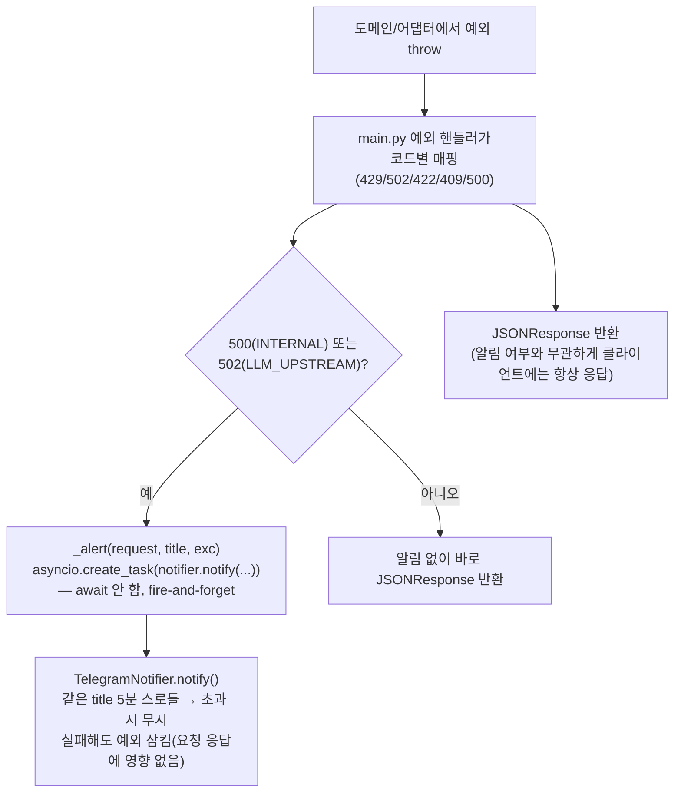
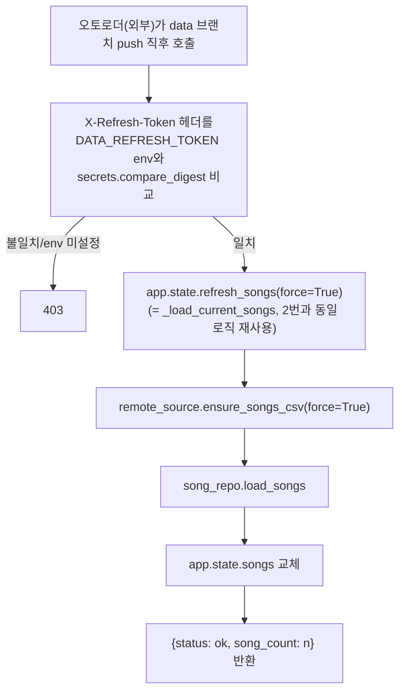

# 2026-07-29 — 백엔드 실행 흐름 다이어그램 (기동 / 백그라운드 / 요청 / 이벤트)

> **상태: 코드 리딩 기록.** 세션에서 `src/backend/app/main.py`·`api/routes.py`·
> `repo/remote_source.py`·`repo/song_repo.py`·`adapters/groq_adapter.py`·
> `adapters/telegram_notifier.py`·`domain/selection.py`를 근거로 정리했다. 구현이 아니라
> **현재 동작을 트리거(언제 실행되는가) 기준 4분류로 도식화**한 문서다 — 다음에 이 경로를
> 수정할 때 참조용.

## 분류 기준

"처음 시작 시 / 사용자 요청 시" 2분류로는 주기적 백그라운드 리프레시와 에러·관리자 트리거가
빠진다. 실행 빈도로 보면 4가지:

| 구분 | 시점 | 빈도 | 코드 진입점 |
|---|---|---|---|
| 1. 기동 시 | 프로세스 시작 | 1회 | `main.py:323 create_app()` |
| 2. 백그라운드 주기 | 기동 후 지속 | 반복(기본 30분) | `main.py:302 _refresh_loop()` |
| 3. 사용자 요청 시 | HTTP 요청 | 요청마다 | `api/routes.py` 각 핸들러 |
| 4. 조건부/이벤트 트리거 | 특정 이벤트 | 비정기 | `main.py:214 _alert()`, `api/routes.py:194 refresh_data()` |

미들웨어 실행 순서 주의: `main.py:328-335`에서 `InflightLimitMiddleware`를 먼저
`add_middleware`하고 `CORSMiddleware`를 나중에 추가하므로, **실행 시에는 CORS가 가장
바깥, Inflight가 그 안쪽**이다(나중에 추가한 미들웨어가 바깥을 감싸는 Starlette 규칙 —
503 거절 응답에도 CORS 헤더가 붙게 하려는 의도, `main.py:233` 주석).

---

## 1. 서버 기동 시 (`create_app()`, 1회)

---

## 2. 백그라운드 주기 루프 (`_refresh_loop`, 요청과 무관)

---

## 3. 사용자 요청 시

### 3a. 읽기전용 GET — `/api/health`, `/api/bands`, `/api/songs`

외부 호출·LLM·Inflight 카운트 제한 모두 없음 — 가장 가벼운 경로.

### 3b. `POST /api/setlist` (핵심 경로)

---

## 4. 조건부 / 이벤트 트리거

### 4a. Inflight 큐 초과 — FastAPI를 거치지 않는 ASGI 레벨 응답

### 4b. 에러 발생 시 알림 (`_alert`, 3b의 예외 경로와 연결)

### 4c. 관리자 강제 리프레시 — `POST /api/admin/refresh-data`

2번(백그라운드 주기 루프)과 내부 로직은 동일하지만, 트리거가 타이머가 아니라 **오토로더의
즉시 HTTP 호출**이라는 점이 다르다 — push 직후 최대 30분(`DATA_REFRESH_INTERVAL_SEC`)을
기다리지 않게 하려는 용도(`main.py:19-20` 주석).

---

## 관련

- 근거 대화: 2026-07-29 세션(main.py 코드 리딩 중 "요청이 어떻게 흐르는지" 질문에서 파생).
- 코드 위치: `src/backend/app/main.py`, `src/backend/app/api/routes.py`,
  `src/backend/app/repo/remote_source.py`, `src/backend/app/repo/song_repo.py`,
  `src/backend/app/adapters/groq_adapter.py`, `src/backend/app/adapters/telegram_notifier.py`,
  `src/backend/app/domain/selection.py`.
- 관련 기존 문서: `archive/last-papers/reports/2026-07-15-remote-data-serving-design.md`
  (원격 데이터 서빙 설계 — 위 2번·4c 다이어그램이 구현된 결과).
