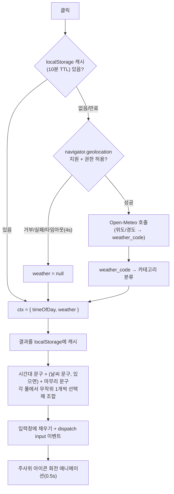

# 2026-08-11 — 오마카세 버튼 로직 및 분류표

> **상태: 기능 요약 기록.** `feature/omakase-prompt-button` 브랜치(PR #66, 태그 `v2.1.0`)의
> `src/frontend/app.js`를 근거로 정리했다. AI 모드 프롬프트 입력창의 🎲 오마카세 버튼이
> 클릭 시 시간대·날씨를 조합해 프롬프트 문구를 자동 생성하는 로직 — 다음에 문구 풀을
> 늘리거나 날씨 소스를 바꿀 때 참조용.

## 흐름

같은 페이지 안에서 연타해도 인메모리 프라미스(`omakaseCtxPromise`)가 진행 중인 fetch 하나만
공유하게 해 중복 요청을 막는다(`app.js:141-167`). TTL 캐시는 별도로 `localStorage`가 담당하며,
날씨 조회 실패(`weather: null`)도 그대로 캐시해 재시도하지 않는다(`app.js:127` 주석).

## 시간대 분류 (`omakaseTimeOfDay`, `app.js:99-105`)

| 시간(로컬) | 구간 키 |
|---|---|
| 05:00–07:59 | `dawn` (새벽) |
| 08:00–10:59 | `morning` (아침) |
| 11:00–16:59 | `afternoon` (오후) |
| 17:00–20:59 | `evening` (저녁) |
| 21:00–04:59 | `night` (밤) |

## 날씨 분류 (`omakaseWeatherCategory`, `app.js:107-114`, Open-Meteo `weather_code` 기준)

| WMO 코드 범위 | 카테고리 |
|---|---|
| 0 | `clear` (맑음) |
| 1–3, 45, 48 | `cloudy` (흐림/안개) |
| 51–67, 80–82 | `rain` (비) |
| 71–77, 85–86 | `snow` (눈) |
| 95 이상 | `storm` (뇌우) |
| 그 외 | `null` (문구에서 날씨 절 생략) |

## 문구 풀 (`app.js:83-97`)

시간대·날씨 문구는 각 카테고리당 2개씩, 마무리 문구는 공통 3개다. 조합 시
`(날씨 문구, 있으면) + 시간대 문구 + 마무리 문구` 순으로 이어붙인다(`buildOmakasePrompt`,
`app.js:169-177`). 예: "흐린 날씨에 잔잔한 늦은 밤 감성적인 플리 하나 뽑아줘".

| 분류 | 문구 예시(2개 중 무작위 1개) |
|---|---|
| 시간대 `dawn` | 차분하게 하루를 여는 / 고요한 새벽 감성의 |
| 시간대 `morning` | 상쾌하게 하루를 시작하는 / 기운 넘치는 아침 |
| 시간대 `afternoon` | 나른한 오후를 깨워줄 / 집중력 올려주는 |
| 시간대 `evening` | 노을 지는 저녁에 어울리는 / 하루를 마무리하는 잔잔한 |
| 시간대 `night` | 늦은 밤 감성적인 / 잠들기 전 편안한 |
| 날씨 `clear` | 맑고 청량한 / 햇살 좋은 날씨에 어울리는 |
| 날씨 `cloudy` | 흐린 날씨에 잔잔한 / 구름 낀 하늘 아래 아련한 |
| 날씨 `rain` | 비 오는 날 감성적인 / 빗소리와 잘 어울리는 |
| 날씨 `snow` | 눈 내리는 날의 포근한 / 하얗게 눈 쌓인 겨울 감성의 |
| 날씨 `storm` | 천둥번개 치는 날 몰입감 있는 / 폭풍우 속 강렬한 |
| 마무리(공통) | 플레이리스트 만들어줘 / 세트리스트 부탁해 / 플리 하나 뽑아줘 |

## 날씨 API 남용 방지 설계

| 계층 | 역할 | 근거 |
|---|---|---|
| 인메모리 프라미스(`omakaseCtxPromise`) | 같은 페이지 내 연타 시 진행 중인 fetch 1개만 공유 | `app.js:139-141` ponytail 주석 |
| `localStorage` 10분 TTL(`omakaseWeatherCache`) | 새로고침·재방문에도 재조회 방지, 실패도 캐시 | `app.js:118-121, 127` |

키가 필요 없는 공개 API(Open-Meteo)를 프론트에서 직접 호출하므로 백엔드 경유·시크릿 관리가
불필요하다. 버튼은 입력창을 채우기만 하고 자동 제출하지 않는다 — 사용자가 마음에 드는 문구가
나올 때까지 여러 번 눌러본 뒤 직접 "플레이리스트 만들기"를 눌러야 요청이 나간다.
