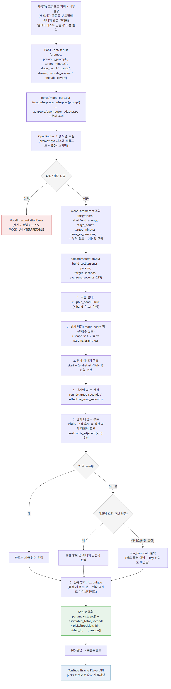

# v1.0.0 "플레이리스트 만들기" 버튼 선곡 로직 흐름도

- **대상 시점**: `main`의 git tag `v1.0.0` (commit `515e9ea`)
- **근거 문서**: 해당 커밋의 `docs/architecture.md` "스키마 1~3" 서술(LLM 출력 스키마, 선곡 엔진
  입출력, 백엔드 API)을 도식화한 것 — 새 코드나 새 결정을 추가한 것이 아니라 당시 텍스트 서술을
  그림으로 옮긴 것뿐이다.
- **당시 LLM 벤더**: OpenRouter(`adapters/openrouter_adapter.py`). 이후 Groq로 교체되었다
  (`main`의 `CLAUDE.md` "Resolved" 항목 참조) — 이 다이어그램은 v1.0.0 시점 기록이므로 교체 이전
  상태를 그대로 반영한다.

## 다이어그램

소스: [`2026-08-14-v1.0.0-setlist-button-flow.mmd`](./2026-08-14-v1.0.0-setlist-button-flow.mmd)
(Mermaid, `mmdc`로 렌더링)

## 흐름 요약

1. 사용자가 프롬프트 + 세부설정(재생시간·곡종류·밴드필터·에너지 텐션 그래프)을 입력하고 버튼 클릭
   → `POST /api/setlist`.
2. `ports/mood_port.py`의 `MoodInterpreter` 포트를 통해 `adapters/openrouter_adapter.py`가 LLM을
   호출, 프롬프트를 `MoodParameters`(brightness, 시작/종료 에너지, stage_count 등)로 변환. 파싱
   실패 시 재시도 없이 `422 MOOD_UNINTERPRETABLE`.
3. `domain/selection.py`의 순수 함수 `build_setlist()`가 곡풀 필터 → 밝기 랭킹 → 단계별 에너지
   목표(선형 보간) → 단계별 곡 수 산정 → 단계 내 선곡(에너지 근접 + 하모닉 호환 우선, 인접 고갈
   시 non_harmonic 폴백) → 중복 방지 순으로 `Setlist`를 조립.
4. 응답을 받은 프론트엔드가 YouTube iframe Player API로 `picks` 순서대로 순차 자동재생.
