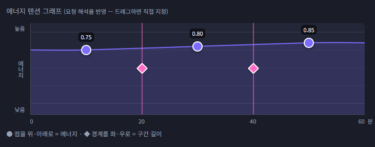
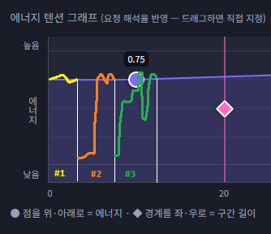

# Case-report

- 프롬프트 : 헬스로 불태울만한 노래로 구성해줘.
- 재생시간 : 60
- 에너지 단계 수 : 3
- 밴드 필터 : RAS, Mutype
- 에너지 텐션 그래프 : 

- 플레이리스트
    #1. Keep the Heat and Fire Yourself Up (Cover)
    #2. TRASH LIFE
    #3. 神っぽいな (Cover)
    #4. Hey-day狂騒曲(カプリチオ)
    #5. Hi-Vision
    ...

# 사용자 평가

- 밴드필터를 사용자가 2개밴드로 제한함으로써 프롬프트에 부합하는 곡이 많이 선택되었음.

- 그러나 노래의 일부분이 에너지 텐션이 급격히 꺾이는 부분이 등장함으로써 연속성이 없는 느낌이 있었음. 세부적으로 표현 시 아래와 같음.
    * #1은 전형적으로 전구간에서 하이텐션인 프롬프트에 제격인 곡임. 
    * #2는 인트로가 조용하게 시작됨. 따라서 #1의 마지막 부분 텐션이 비슷하게 이어지는 느낌이 들지 않음. 이 곡은 ~1:01까지 텐션이 점점 올라오는 형태의 곡으로, 만약 1:02부터 이어졌다면 아주 괜찮은 선택곡이었음. 그러나 인트로 구간으로 인해 #1과 연결감이 들지 않아 순서 배치에 문제가 있다고 사료됨.
    * #3은 분위기가 조금 뒤집히나 이 정도 반전은 괴리감 없음. 1:31~1:50까지 모듈레이션을 하다가 1:51~2:08까지 차분하게 진행하다가 그 뒤에 원래의 텐션으로 돌아가는 특징이 있음. 이렇게 곡 중간에 텐션변동은 받아들일 수 있음.

- 위의 상황을 그림으로 표현하면 아래와 같음.

    

    * 이전 곡의 outro과 다음 곡의 intro의 텐션이 이어지지 않음. 완전히 이어지게 만들 수 없으나 큰 변동이 없어야 함.
    * 곡 내에서 변동하는 텐션은 정상적인 것으로 이는 고려하지 않아도 됨.

# 종합

- 이전곡과 다음곡의 연결지점의 텐션 차이를 최대한 줄일 것.

- 팁을 주자면 인트로 텐션이 낮은 곡을 앞쪽으로 우선 재생되도록 배치하고, (현재곡 아웃트로의 텐션 - 다음곡 인트로의 텐션) 값이 일정 threshold(세부설정에 추가 필요) 이내인 노래들 중 랜덤 셀렉트하는 방식으로 하기.

- 만약 위와 같이 배치하다가 인트로가 조용하거나 아웃트로가 조용하게 끝나는 노래가 있다면 곡 중간중간에 배치하기. 단 최대한 이 곡들은 서로 플레이리스트 거리 2 이상이 되도록 배치해야함. 그렇게 하였음에도 남은 경우 첫 순서를 제외한 나머지 순서 사이에 랜덤 배치한다.

# 추가 제안

- 프롬프트를 "RAS와 뮤타입 노래로 헬스로 불태울만한 노래로 구성해줘."라고 밴드명을 명시하면 해당 밴드만 자동 선택되도록 하기. 아래는 각 밴드를 부르는 별명이야.
    * poppin party : 포핀파티, 포피파, 뽀삐빠 등
    * Roselia : 로젤리아, 로젤, 로제리아, 로제 등
    * Raise A Suilen : 라스, RAS, 레이즈어수이렌 등
    * Pastel Palettes : 파스텔, 파스텔팔레트, 파스파레 등
    * Afterglow : 애프터글로우, 앱글 등
    * Hello Happy World : 헬로해피월드, 헬로해피, 하로하피, 하로핫삐, 하로하삐 등
    * Morfonica : 모르포니카, 몰포, 몰포니카 등
    * Mygo : 마이고, 미아 등
    * Ave mujica : 아베무지카, 아베무, 아베 등
    * Mugendai Mutype : 뮤타입, 믂타입, 무겐다이 뮤타입, 유메미타, 윾메미타 등

- 밴드 Various artists, new-born band(1곡만 있는 밴드) : 현재 누락됨. 모두 추가할 것.

- 이 플레이리스트 공유 시 전체를 '유튜브 재생목록'으로 제공되어야 함.

- 현재 프롬프트에 대한 세부설정 세팅을 잘 반영하지 못하는 것으로 보임. 예를 들어 "유산소에 어울리는 플리만들어줘."라고 요청을 보내면, openrouter ai가 "유산소 운동을 몇 단계 페이즈로 나누면 좋을까? 각 페이즈 구간의 길이는 얼마가 좋을까? 각 페이즈의 텐션값은 얼마일까?"와 같이 에너지 텐션 그래프의 파라미터 값을 우선 결정하도록 스스로 질문을 하도록 함. 그 후 플레이리스트 생성하기.

- 세부설정에서 오리지날/커버 곡 선택 체크박스를 제공. "[] Original   [] Cover"와 같이 표시되고, 디폴트는 original만 체크되고, 전체 해제 시 자동으로 ALL(모두 체크) 선택됨.