# v2.2.0 — 사용자 프롬프트 → 플레이리스트 생성 흐름

> **상태: 배포판 기준 로직 기록.** `main`(태그 `v2.2.0` 및 그 이후 동일 내용의 origin/main
> HEAD, PR #66 오마카세 + PR #67 테마토글까지 포함)의 `src/backend/app/`을 근거로 정리했다.
> 실제 배포 중인 경로는 **단일호출 `GroqMoodInterpreter`**다 — `docs/diagrams/multistage-*.mmd`
> (untracked 산출물)는 아직 미배포 실험 어댑터(`groq_multistage_adapter`, `MOOD_INTERPRETER`
> 미설정 시 절대 선택되지 않음)에 대한 것이므로 착각하지 말 것. 오래된 배경 지식은
> `archive/last-papers/reports/2026-07-29-request-flow-diagrams.md`(3b 절)를 재활용·확장했다.

## 전체 흐름

```mermaid
flowchart TD
    A["POST /api/setlist<br/>{prompt, previous_prompt?, bands?, mode, ...}"] --> B{"mode == custom<br/>또는 TPM 리미터 비활성?"}
    B -- "예" --> C["_run_setlist() 즉시 동기 실행"]
    B -- "아니오(AI 모드+큐 활성)" --> Q["estimate_fn()으로 대기시간 추정<br/>→ job_store.submit(백그라운드 스레드)<br/>→ 202 {job_id, estimated_wait_seconds}"]
    Q --> QP["프론트: GET /api/setlist/status/{job_id} 폴링"]
    QP --> C

    C --> D["band_filter = payload.bands ∪ detect_bands(prompt)<br/>(LLM 호출 전에 결정)"]
    D --> E{"모드"}
    E -- "custom" --> E1["LLM 호출 없이 payload.stages로<br/>MoodParameters 직접 구성 (honor=True)"]
    E -- "AI(자연어)" --> E2["pool = band_filter 적용 곡<br/>energy_stats·feature_stats(오디오 6지표 분포) 계산"]
    E2 --> F["interpreter.interpret(prompt, previous_prompt,<br/>energy_stats, feature_stats)"]

    subgraph LLM["GroqMoodInterpreter.interpret() — 단일 호출"]
        direction TB
        F1["prompt.build_messages()로 system+user 메시지 조립<br/>(feature_stats는 system 말미 블록으로 첨부)"]
        F1 --> F2["POST /chat/completions (temperature=0.2)"]
        F2 --> F3{"429/5xx?"}
        F3 -- "예" --> F2note["지수백오프 재시도<br/>(GROQ_MAX_RETRIES, 기본 2)"]
        F3 -- "아니오(200)" --> F4["prompt.parse_mood(content)<br/>JSON 관용적 추출 + 필드 클램프"]
        F4 --> F5{"파싱 성공?"}
        F5 -- "아니오" --> F4note["재호출<br/>(GROQ_MOOD_RETRIES, 기본 3)"]
        F5 -- "예" --> F6["MoodParameters 반환"]
    end

    F --> LLM
    LLM --> G["params.stage_bands를 실제 감지 밴드로 검증<br/>honor=False 고정(AI 모드는 항상 재해석)"]
    E1 --> H
    G --> H["song_type 필터(Original/Cover)<br/>stage_specs 구성(custom만)<br/>stage_count(2~11)/target_minutes(10~180) clamp"]
    H --> I["resolve_stage_impression_text() → 임베딩 벡터화<br/>(실패해도 중립 처리, 선곡은 안 막힘)"]
    I --> J["build_setlist(songs, params, target_seconds,<br/>band_filter, stage_specs, impression_vectors)"]

    subgraph SEL["domain/selection.py — 순수 함수(LLM·HTTP 무의존)"]
        direction TB
        SA["Stage A(SELECT)<br/>슬롯별 에너지 허용창 하드선택<br/>+ 밝기 버킷 + 6지표거리 + 가사유사도"]
        SA --> SB["Stage B(SEQUENCE)<br/>곡 경계 텐션 최소화 그리디 체인<br/>+ 하모닉 소프트 + 오프너 룰 + 2-opt 국소개선"]
    end
    J --> SEL
    SEL --> K["Setlist(트랙 순서 + 이유 메타 + 총재생시간)"]
    K --> L["serialize_setlist() + applied_bands/honored_overrides 등 부가"]
    L --> M["200 JSON 응답"]

    style LLM fill:#fff3e0,stroke:#e0a030
    style SEL fill:#e8f4ea,stroke:#4a4
```

## 1. 요청 접수·큐잉 (`routes.py`)

- `POST /api/setlist` → `create_setlist()`. 응답에 `Cache-Control: no-store`.
- `mode == "custom"`(세부설정 모드)이거나 TPM 리미터가 비활성이면 `_run_setlist()`를 **즉시
  동기 실행**한다.
- AI 모드 + TPM 리미터 활성 시에는 밴드필터·풀 계산 → `estimate_fn()`으로 대기시간 추정 →
  `job_store.submit()`으로 백그라운드 스레드에 등록 → `202 {job_id, estimated_wait_seconds,
  queue_position}`을 즉시 반환한다. 프론트는 `GET /api/setlist/status/{job_id}`를 폴링해
  완료를 확인한다(비동기 잡+폴링, PR #64).

## 2. `_run_setlist()` 내부 순서

1. **밴드 필터**: `payload.bands ∪ detect_bands(payload.prompt)`(`band_aliases.py`) — LLM
   호출 **전에** 결정되며 LLM 결과와 무관하다.
2. **모드 분기**:
   - `custom`: LLM 호출 없이 `payload.stages`로 `MoodParameters`를 직접 구성, `honor=True`.
   - AI 모드: `pool`(밴드필터 적용 곡)의 `energy_stats`(min/max/mean/std) + `_feature_stats(pool)`
     (오디오 6지표 분포, 표본 10 미만 밴드는 통계에서 제외)를 계산해
     `interpreter.interpret(prompt, previous_prompt, energy_stats, feature_stats)` 호출.
     결과의 `params.stage_bands`는 `_validate_stage_bands()`로 실제 감지 밴드만 남기고,
     `honor=False`로 고정한다(AI 모드는 세부설정 override를 갖지 않고 항상 LLM 재해석 결과를
     따르는 설계).
3. **커버/오리지널 필터**: 사용자 명시값이 항상 LLM `song_type`보다 우선.
4. **stage_specs**: `honor=True`(custom)일 때만 `payload.stages`로 `StageSpec` 리스트를
   강제 구성. 총 곡수가 180분 상당을 넘으면 비례 축소.
5. **stage_count/target_minutes 확정**: stage_specs가 있으면 그로부터 산출, 없으면
   `params.stage_count`(2~11)/`params.target_minutes`(10~180)를 clamp.
6. **impression 텍스트/임베딩**: `resolve_stage_impression_text()`(스펙 우선 → LLM
   `stage_params.impression` 폴백) → 임베딩 벡터화. 실패해도 해당 스테이지만 중립(None)
   처리되고 선곡 자체는 막히지 않는다.
7. **`build_setlist(...)`** 호출(아래 4절).
8. **직렬화**: `serialize_setlist()` + `applied_bands`/`include_original`/`include_cover`/
   `honored_overrides` 메타 부가.

## 3. LLM 호출 — 단일 호출 구조 (`groq_adapter.py` + `prompt.py`)

- `GroqMoodInterpreter.interpret()`가 `prompt_mod.build_messages()`로 system+user 메시지를
  조립해 `temperature=0.2`로 `/chat/completions` 1회 호출한다(멀티스테이지 순차 호출이
  **아니다** — `groq_multistage_adapter`는 별도 미배포 실험 경로).
- `SYSTEM_PROMPT`가 지시하는 추출 필드: `brightness`(-1~1), `start_energy`/`end_energy`
  (0~1), `stage_count`(2~5), `stage_energies`(비단조 에너지 아크, 선택), `stage_minutes`,
  `stage_bands`, `target_minutes`(10~180), `interpretation_summary`, `tags`, `song_type`,
  `same_as_previous`, `stage_params`(스테이지별 `valence/lufs_integrated/lra/
  danceability_norm/instr_stem_ratio/speech_median` 6수치 + `impression` 텍스트).
- 예시 문구는 `_build_dynamic_examples()`가 호출마다 jitter를 줘 모델이 예시를 그대로
  베끼는 걸 방지한다.
- **에러/재시도 2단**: ① HTTP 레벨 429/5xx → 지수백오프 재시도(`GROQ_MAX_RETRIES`, 기본
  2회) 후에도 실패하면 `LLMRateLimitError`/`LLMUpstreamError`. ② 200 응답인데 무드 JSON
  파싱 실패(`parse_mood()`) → 재호출(`GROQ_MOOD_RETRIES`, 기본 3회) 후에도 실패하면
  `MoodInterpretationError`. **둘 다 폴백값 생성 없이** 예외를 그대로 상위(main.py 예외
  핸들러)로 전파한다(429/502/422로 매핑).
- `TPM 예산`(`GROQ_RATE_PER_MIN`)이 활성이면 HTTP 호출 전에 `TokenBucketLimiter.acquire()`로
  선차감한다 — 대기열 초과 시에도 `LLMRateLimitError`.

## 4. 선곡 로직 — `build_setlist()` (`domain/selection.py`, 순수 함수)

LLM·HTTP에 무의존이라 단위 테스트로 검증 가능(`src/tests`). `pool`(에너지허용 밴드 ∧
band_filter 곡)이 0건이면 즉시 `NoSetlistError`(409).

- **목표 계산**: `params.stage_energies`(LLM이 비단조 아크를 직접 줬으면 그대로) 또는
  `stage_energy_targets(start, end, stage_count)`(선형 보간)로 스테이지별 목표 에너지 산출.
  `distribute_counts`/`distribute_counts_by_weights`(stage_minutes 비율 있으면 가중)로
  스테이지별 곡수 배분 → `continuous_slot_targets()`로 곡 슬롯 단위 보간 목표까지 세분화.

### Stage A — SELECT(하드 선택)

슬롯마다:
1. 스테이지 고정 밴드(`stage_bands_resolved[i]`)가 있으면 최우선 하드필터.
2. `|energy − slot_target| ≤ 0.08`(허용창) 내 후보 우선. 있으면 ①밝기 버킷 근접
   ②6지표 거리 ③가사 임베딩 유사도(4순위) 순으로 정렬해 선택(매 슬롯 rng 셔플로 변주).
3. 허용창 내 후보가 없으면 허용창 밖 최근접("완충 노드")을 채택하되, 편차가
   0.16(`_HARD_TOL`)을 넘으면 그 슬롯은 **스킵**한다(에러가 아니라 결과 곡 수가 목표보다
   적어지는 방식의 degraded 처리).

### Stage B — SEQUENCE(곡 순서 배치)

`_sequence_by_continuity()` — 곡 경계 텐션(이전 곡 아웃트로 ↔ 다음 곡 인트로) 최소화
그리디 체인:
- 시드곡: 스테이지 첫 곡이면 강도 부합 후보 중 인트로 텐션이 가장 높은 곡(오프너 룰),
  아니면 이전 곡 아웃트로 + 슬롯 목표를 종합해 가장 가까운 곡.
- 이후 각 슬롯: `cost = 경계갭 + 0.15(비하모닉 페널티, Camelot 비인접 시) + 1.5×슬롯목표
  이탈`. 최소비용 후보 + 0.05 슬랙 이내에서 랜덤 선택(매번 완전히 동일한 순서가 나오지
  않게).
- 스테이지 크기가 40 이하면 2-opt 스왑으로 국소 개선(`_local_refine_order()`)까지 수행.

## 5. 에러/폴백 요약

| 상황 | 결과 |
|---|---|
| Groq 429/5xx, 재시도 소진 | `LLMRateLimitError`(429) / `LLMUpstreamError`(502) |
| 200이지만 무드 JSON 파싱 끝내 실패 | `MoodInterpretationError`(422) |
| Stage A 후보 부족(허용창 밖도 0.16 초과) | 해당 슬롯만 스킵 — 결과 곡 수가 목표보다 적을 수 있음(에러 아님) |
| 밴드 필터 결과 후보 0건 | `NoSetlistError`(409 NO_SETLIST) |
| 가사 임베딩 실패 | 예외 삼키고 해당 스테이지만 중립 처리, 선곡은 계속 진행 |

## 관련

- 요청 큐잉·미들웨어·기동 시퀀스 등 이 문서가 다루지 않는 주변부는
  `archive/last-papers/reports/2026-07-29-request-flow-diagrams.md` 참조(1~4절, 3b 절이
  이 문서와 가장 겹침 — 이 문서는 그중 Stage A/B 알고리즘 내부를 확장했다).
- 코드 위치: `src/backend/app/api/routes.py`, `src/backend/app/adapters/groq_adapter.py`,
  `src/backend/app/adapters/prompt.py`, `src/backend/app/domain/selection.py`,
  `src/backend/app/domain/models.py`.
