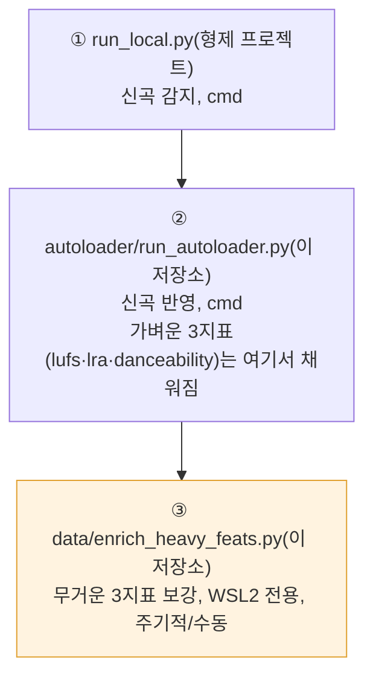
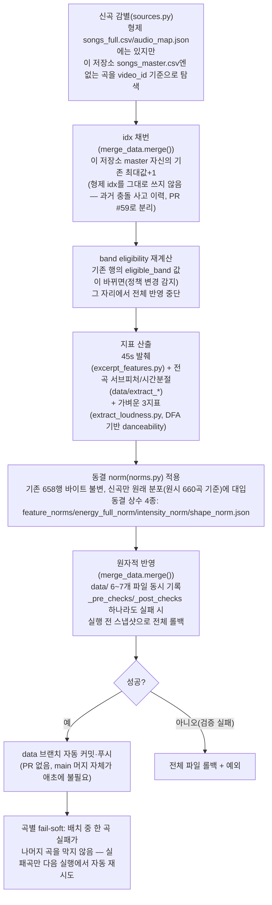
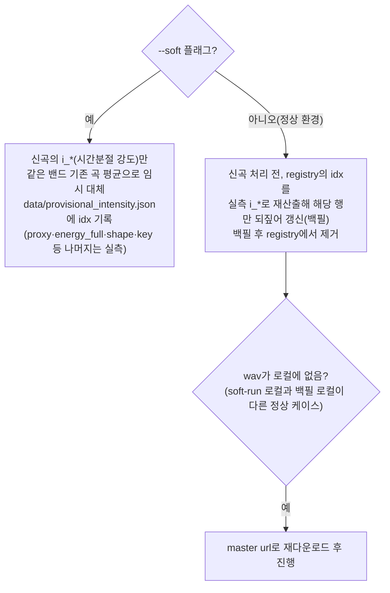

# v2.2.0 — semi-autoloader(신곡 오토로더) 작동 로직

> **상태: 배포판이 소비하는 데이터의 생산 경로 기록.** 이 로직 자체는 `main`이 아니라
> `tools` 브랜치(`auto-loader/`, `main`에는 절대 머지되지 않는 상시재사용 단일 브랜치)에
> 있지만, 배포된 백엔드가 서빙하는 `data/songs_master.csv`가 어떻게 만들어지는지는
> "배포판이 사용 중인 기능"의 전제 조건이라 이 묶음에 함께 기록한다. 근거:
> `tools:auto-loader/README.md`(2026-08-03 확정 운영 순서 기준).

**감지는 형제 프로젝트(bandori-song-sorter) Actions가 전담**하고, 이 저장소의 오토로더는
"형제 origin/main에 반영된 곡"과 "이 저장소 `data` 브랜치 `songs_master.csv`"의 차이만
처리한다. yt-dlp 다운로드가 데이터센터 IP를 봇월에 막혀 **집 IP 로컬 실행이 필요**해서
cron 완전자동이 아니라 사람이 트리거하는 반자동 툴이다.

## 전체 운영 순서 (3단계, ①·②는 cmd, ③만 가끔 WSL2)

무거운 3지표(`valence_median`·`instr_stem_ratio`·`speech_median`)는 ②에서 항상 빈 칸으로
남는 게 **의도된 동작**이며, ③이 멱등하게(이미 채워진 행은 건드리지 않음) 나중에 채운다.

## ② autoloader/run_autoloader.py — 신곡 1곡이 반영되는 과정

- **검증 항목**(`_pre_checks`/`_post_checks`): video_id/idx 유일성, camelot 매핑 성공, 기존
  행 바이트 불변, append 파일이 기존 내용의 순수 연장인지("append-only, 기존 바이트 불변"
  원칙).
- **재실행 안전**: video_id 기준 감별이라 멱등, 실패 곡은 다음 실행에서 자동 재시도.

## `--soft` 모드 (부분 wav 환경 긴급 반영)

`intensity_norm` 부트스트랩은 원본 **전곡** wav를 요구해, wav 캐시가 부분적인 로컬(예:
285/660곡)에서는 신곡 반영이 통째로 막힌다.

운영 시나리오: **타 로컬에서 `--soft`로 일단 곡 반영 → 원본 wav 있는 메인 로컬에서 일반
run으로 정밀 산출값까지 마무리.**

## ③ data/enrich_heavy_feats.py — 무거운 3지표 주기적 보강

- **목표**: `songs_master.csv`의 `m6-valence_median`(감정 밝기), `m9-instr_stem_ratio`
  (보컬/악기 비중), `m11-speech_median`(음절 밀도)을 실측값으로 보강.
- **의존성**: essentia-tensorflow, librosa, scipy, torch — **WSL2 전용**(Debian PEP 668로
  venv 필수). 없으면 fail-soft로 안내 후 조용히 종료.
- 신곡마다 매번 돌릴 필요 없이, 밀린 곡이 쌓이면 가끔 실행(멱등 — 이미 채워진 행은 건드리지
  않음).

## 배포판과의 연결

이 오토로더가 `data` 브랜치에 push하면, 배포된 백엔드(`src/backend/app/repo/
remote_source.py`)는 **기동 시 + 주기 리프레시(기본 30분) + 관리자 강제 리프레시
엔드포인트**(`POST /api/admin/refresh-data`, 오토로더가 push 직후 호출 시도) 셋 중 하나로
새 데이터를 원격 fetch해 반영한다. `main` 재배포는 전혀 발생하지 않는다(설계 의도: 신곡
추가가 서비스 슬립/재배포를 유발하지 않게 하기 위함). 이 부분의 상세 시퀀스는
`archive/last-papers/reports/2026-07-29-request-flow-diagrams.md`의 2번(백그라운드 주기
루프)·4c(관리자 강제 리프레시) 절 참조.

## 관련

- 코드/문서 위치: `tools` 브랜치 `auto-loader/README.md`,
  `auto-loader/autoloader/{sources,merge_data,fetch_new,excerpt_features,norms}.py`,
  `auto-loader/data/enrich_heavy_feats.py`.
- 과거 상세 기록: `archive/last-papers/reports/2026-07-15-song-autoloader-shape-fix-and-norm-methodology.md`.
