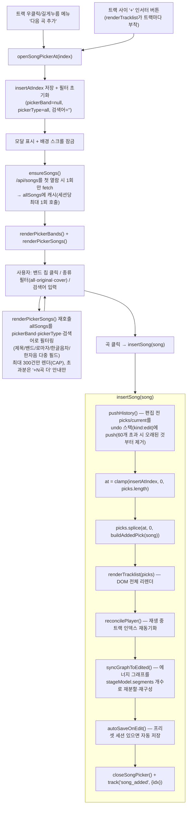

# v2.2.0 — 곡 추가(트랙 사이 미니 브라우저) 로직

> **상태: 배포판 기준 로직 기록.** `main`(origin/main HEAD, v2.2.0 태그 이후 동일 내용)의
> `src/frontend/app.js`를 근거로 정리했다. 플레이리스트 편집 중 밴드/곡 미니 브라우저로
> 트랙 사이에 곡을 직접 삽입하는 기능.

## 흐름

## 진입 지점 (`app.js:1743-1812`)

- 트랙 우클릭/길게누름 메뉴(`attachTrackLongPress`)의 "다음 곡 추가" → `openSongPickerAt(index + 1)`.
- 트랙 사이 `+` 인서터 버튼(`makeInserter(atIndex)`, `renderTracklist`가 각 트랙 뒤에
  `makeInserter(i+1)`로 부착) 클릭 → `openSongPickerAt(atIndex)`.

## 모달 오픈 — `openSongPickerAt(atIndex)` (`app.js:2456-2476`)

1. `insertAtIndex = atIndex` 전역 상태로 저장.
2. 밴드 선택/곡 종류 필터/검색어 초기화.
3. 안내 문구(`atIndex<=0` → "맨 앞에 삽입", 그 외 → "N번 다음에 삽입").
4. 모달 표시 + 배경 스크롤 잠금.
5. `ensureSongs()`로 `/api/songs`(660곡 전체)를 **첫 열람 시 1회만** fetch해 `allSongs`에
   캐시(이후 재오픈 시 재호출 없음 — 페이지 로드 시점엔 안 부르는 지연 로딩).
6. `renderPickerBands()`/`renderPickerSongs()` 렌더 + 검색창 포커스.

## 필터링/렌더링 (`app.js:2478-2568`)

- 밴드 칩: 전체 곡을 밴드별로 카운트해 표시, 클릭 시 `pickerBand` 갱신 → 재렌더.
- 곡 종류 필터: "all/original/cover" pill. `isCoverSong` 판정은 제목에 `"(cover)"` 포함
  여부 기준(백엔드 `_is_cover`와 동일 규칙).
- 검색: `allSongs`를 `pickerBand`·`pickerType`·검색어(제목/밴드/로마자/한글음차/한자음 등
  다중 필드)로 필터링, 최대 300건만 표시(CAP) — 초과분은 "+N곡 더" 안내만 표시하고
  실제로는 렌더하지 않는다.

## 삽입 — `insertSong(song)` (`app.js:2570-2580`)

1. `pushHistory()`(`app.js:2167-2170`) — 편집 전 `picks`/`current`를 undo 스택
   (`kind:"edit"`)에 push, 60개 초과 시 오래된 항목부터 제거.
2. `at = clamp(insertAtIndex, 0, picks.length)`로 인덱스 범위 보정.
3. `picks.splice(at, 0, buildAddedPick(song))` — 배열에 실제 삽입.
4. `renderTracklist(picks)` — 트랙리스트 DOM 재렌더(순번·재생시간은 배열 순서 기준으로
   다시 그려짐, 부분 갱신이 아니라 전체 리렌더).
5. `reconcilePlayer()` — 현재 재생 중이던 `video_id` 기준으로 `current` 인덱스 재동기화
   (없으면 범위 clamp).
6. `syncGraphToEdited()`(`app.js:2209~`) — 편집된 순서를 `stageModel.segments.length`개
   그룹으로 재분할해 평균 에너지/곡수 비율로 그래프 재구성. `stageTouched`(사용자가 그래프를
   직접 드래그했는지 여부)는 건드리지 않는다.
7. `autoSaveOnEdit()` — 프리셋 세션이 있으면 `upsertPreset`으로 현재 상태 자동 저장.
8. `closeSongPicker()` + `track("song_added", {idx})` 계측 로깅.

## 추가곡 데이터 — `buildAddedPick(song)` (`app.js:2583-2592`)

**하모닉/에너지 재계산은 하지 않는다** — 단순 고정값을 채워 배열에 끼워 넣는다:

| 필드 | 값 |
|---|---|
| `harmonic` | `"added"` |
| `matched_energy` | `song.energy`(원곡 값 그대로) |
| `stage_energy_target` | `0` |
| `brightness_fit` | `0` |
| `prev_camelot` | `null` |
| `reason.text` | `"직접 추가한 곡"` |

즉 Camelot 호환성이나 에너지 곡선 검증 로직 없이 그대로 삽입되고, 트랙리스트 UI에는
"added" 배지로만 구분된다 — 자동 재배열/재선곡 로직(`domain/selection.py`, 백엔드)과는
완전히 별개의 프론트 전용 삽입이다.

## Ctrl+Z 되돌리기 (`app.js:2181-2204`)

`keydown`에서 Ctrl/Cmd+Z 감지 시 undo 스택을 pop, `kind:"edit"`이면 `picks`/`current`를
pop된 스냅샷으로 되돌리고 `renderTracklist`/`reconcilePlayer`/`syncGraphToEdited`/
`autoSaveOnEdit`를 삽입 시와 동일하게 재실행한다.

## 관련

- 코드 위치: `src/frontend/app.js` (`openSongPickerAt`, `renderPickerBands`,
  `renderPickerSongs`, `insertSong`, `buildAddedPick`, `pushHistory`, `syncGraphToEdited`).
- 대비되는 로직: 하모닉/에너지가 검증되는 정식 선곡 경로는
  `01-prompt-to-playlist-flow.md`의 Stage A/B 참조 — 곡 추가는 그 파이프라인을 거치지
  않는다.
