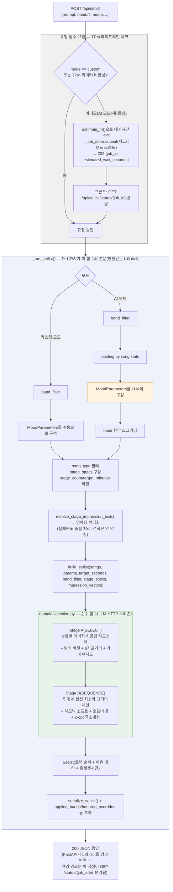
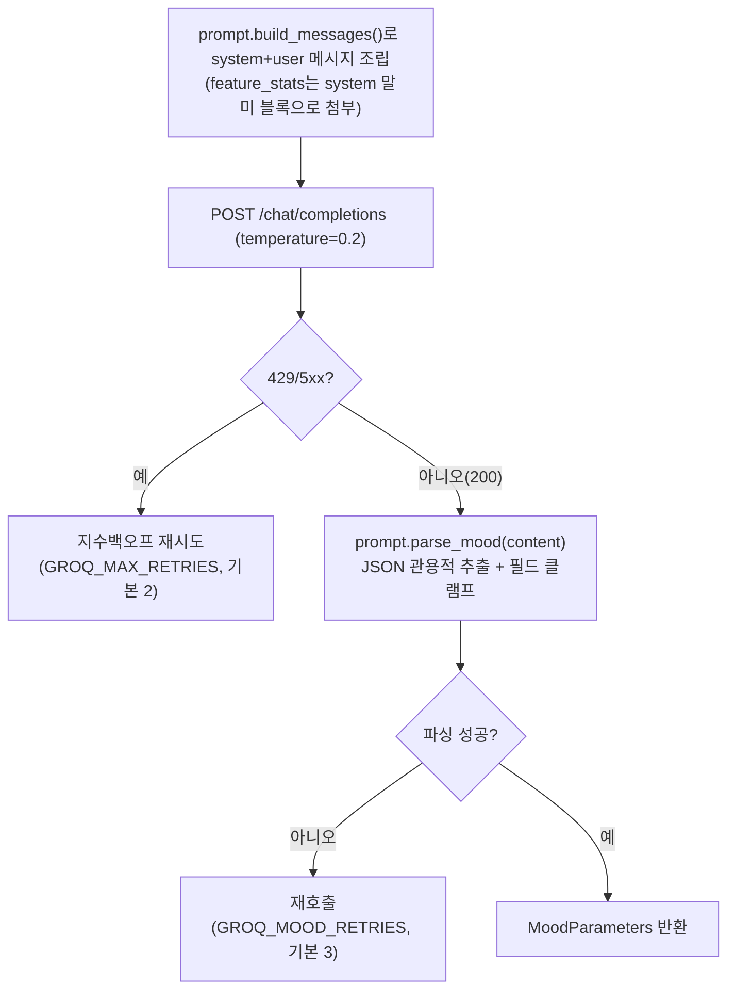

# v2 — 사용자 프롬프트 → 플레이리스트 생성 흐름

> **상태: 배포판 기준 로직 기록(Major v2 계열, 최초 작성 시점 태그 `v2.2.0`).** `main`
> (origin/main HEAD, PR #66 오마카세 + PR #67 테마토글까지 포함)의 `src/backend/app/`을
> 근거로 정리했다. 실제 배포 중인 경로는 **단일호출 `GroqMoodInterpreter`**다 —
> `docs/diagrams/multistage-*.mmd`(untracked 산출물)는 아직 미배포 실험 어댑터
> (`groq_multistage_adapter`, `MOOD_INTERPRETER` 미설정 시 절대 선택되지 않음)에 대한
> 것이므로 착각하지 말 것. 오래된 배경 지식은 `archive/last-papers/reports/
> 2026-07-29-request-flow-diagrams.md`(3b 절)를 재활용·확장했다. 폴더 버전 규칙은
> `archive/version/README.md` 참조 — Patch급 변경은 이 파일을 직접 고쳐 반영한다.

## 전체 흐름



## 1. 요청 접수·큐잉 (`routes.py`)

- `POST /api/setlist` → `create_setlist()`. 응답에 `Cache-Control: no-store`.
- `mode == "custom"`(세부설정 모드)이거나 TPM 리미터가 비활성이면 `_run_setlist()`를 **즉시
  동기 실행**한다.
- AI 모드 + TPM 리미터 활성 시에는 밴드필터·풀 계산 → `estimate_fn()`으로 대기시간 추정 →
  `job_store.submit()`으로 백그라운드 스레드에 등록 → `202 {job_id, estimated_wait_seconds,
  queue_position}`을 즉시 반환한다. 프론트는 `GET /api/setlist/status/{job_id}`를 폴링해
  완료를 확인한다(비동기 잡+폴링, PR #64).

## 2. `_run_setlist()` 내부 순서

1. **밴드 필터(`band_filter`)**: 모드별로 갈라진다. LLM 호출 **전에** 결정되며 LLM 결과와는
   무관하다 — 상세는 아래 "노드 상세: `band_filter`" 참고.
2. **모드 분기**: 결국 둘 다 `MoodParameters`를 만드는 두 가지 경로다 — 좌우 대칭으로 보면
   커스텀은 "수동 구성", AI는 "LLM 자동 구성 + 검증"이라는 차이만 있다.
   - 커스텀: **MoodParameters를 수동으로 구성** — LLM 호출 없이 `payload.stages`(유저가
     그래프로 그린 값)를 그대로 옮겨 담음, `honor=True`.
   - AI: `pooling by song stats`(`pool` 계산) → **MoodParameters를 LLM이 구성**
     (`interpret()`) → **band 환각 스크리닝**(밴드 검증) → `honor=False`로 고정(AI 모드는
     세부설정 override 없이 항상 LLM 재해석 결과를 따르는 설계) — 상세는 아래 "노드 상세"
     참고.
3. **커버/오리지널 필터**: 사용자 명시값(체크박스)이 항상 LLM `song_type`보다 우선. `song_type`
   기본값은 **Original**(2026-08-24 변경, PR #90, `v2.7.3`) — 프롬프트에 곡 종류 언급이
   없으면(원곡 명시 포함) Original, 명시적 커버 요청("커버곡만" 등)이면 Cover, "모든 곡"류
   명시적 전체 요청(표현 다양 — 고정 키워드 매칭이 아니라 `SYSTEM_PROMPT` 지시에 따라 LLM이
   의미로 판단)이면 All. 커버 판정 자체(`_is_cover()`, `routes.py`)는 곡 제목의
   `(Cover)`/`(Solo)`/`(feat. …)` 표기 기준(PR #88, 2026-08-19, `v2.7.2`) — `(Solo)`·
   `(feat.)`도 비-오리지널 파생판으로 취급한다(예전엔 `(Cover)`만 검사해 놓쳤었다).
4. **stage_specs**: `honor=True`(custom)일 때만 `payload.stages`로 `StageSpec` 리스트를
   강제 구성. 총 곡수가 180분 상당을 넘으면 비례 축소.
5. **stage_count/target_minutes 확정**: stage_specs가 있으면 그로부터 산출, 없으면
   `params.stage_count`(2~11)/`params.target_minutes`(10~180)를 clamp.
6. **impression 텍스트/임베딩**: `resolve_stage_impression_text()`(스펙 우선 → LLM
   `stage_params.impression` 폴백) → 임베딩 벡터화. 실패해도 해당 스테이지만 중립(None)
   처리되고 선곡 자체는 막히지 않는다.
7. **`build_setlist(...)`** 호출(아래 4절).
8. **직렬화**: `serialize_setlist()` + `applied_bands`/`include_original`/`include_cover`/
   `honored_overrides` 메타 부가.

### 노드 상세: `band_filter` · `pooling by song stats` · `MoodParameters를 LLM이 구성` · `band 환각 스크리닝`

**`band_filter`(D1/D2) — 모드별 스코프 필터**
- 커스텀 모드(D1): `payload.bands`만 — 유저가 체크박스로 직접 고른 밴드.
- AI 모드(D2): `payload.bands ∪ detect_bands(payload.prompt)` — 체크박스 선택 + 프롬프트
  텍스트 자동감지(`band_aliases.py`, 결정론적 별칭 매칭, **LLM 무관**)의 합집합.
- 두 경우 모두 LLM 호출 **이전에** 확정되고, LLM 결과와 무관하게 고정된다.
- (2026-08-24, PR #91) 이전엔 모드 무관 단일 공식이라 커스텀 모드도 우연히만 의도대로
  동작했음 — 지금은 모드별 명시 분기로 고쳐짐(회귀 없음).

**`pooling by song stats`(E2) — 후보 곡 집합 + LLM용 분포 통계(AI 모드 전용)**
- `pool = band_filter가 적용된 곡 목록`. 커스텀 모드는 LLM을 안 부르므로 이 단계 자체가 없다.
- `energy_stats`: `pool`의 `song.energy` 분포(`min/max/mean/std`).
- `feature_stats`: 오디오 6지표(`valence`/`lufs_integrated`/`lra`/`danceability_norm`/
  `instr_stem_ratio`/`speech_median`) 각각의 분포(`min/max/mean/median/std`) — **전체 +
  밴드별**(표본 10곡 미만 밴드는 통계에서 제외).
- 목적: LLM이 `stage_params` 값을 실제 데이터 분포에 근거해 고르게 함 — 분포 정보가 없으면
  중앙값 근처로 소극적으로 안주하는 문제가 관찰됨. `build_messages()`가 이 통계를 시스템
  메시지 말미 `[지표 분포 통계]` 블록으로 첨부한다.

**`MoodParameters를 LLM이 구성`(`LLM`, 실체는 `GroqMoodInterpreter.interpret()`)**
- 좌우 대칭 짝: 커스텀 모드의 `MoodParameters를 수동으로 구성`(E1)에 대응하는 AI 모드 쪽
  — 유저가 손으로 채우는 대신 LLM이 채운다는 차이만 있을 뿐, 둘 다 하는 일은 같다
  (`MoodParameters` 만들기).
- 전체 흐름도엔 노드 이름만 표시(`GroqMoodInterpreter.interpret(prompt, energy_stats,
  feature_stats)` 호출). 내부 6단계(F1~F6: 메시지 조립 → HTTP POST → 재시도 → 파싱 → 반환)는
  별도 다이어그램으로 분리 — "3. LLM 호출" 절 맨 위 참고(2026-08-24, 가독성 조정).
- 곡을 고르지 않는다. 자연어 요청을 구조화된 파라미터로 "번역"만 하는 단계.
- 반환된 `params.stage_bands`는 이후 `band 환각 스크리닝`을 거친다(바로 아래).

**`band 환각 스크리닝`(G, 실체는 `_validate_stage_bands()`) — LLM이 지어낸 stage_bands 걸러내기**
- `_validate_stage_bands(params.stage_bands, band_names)` — LLM이 스테이지별로 지정한
  `stage_bands`(자유 텍스트, 오탈자·별명·환각 가능)를 다시 `detect_bands()`에 통과시켜 정규
  밴드 id로 재해석.
- 정확히 밴드 1개로 좁혀지고 그 밴드가 `band_names`(=`band_filter`의 근거, 이번 요청에서
  실제로 감지된 밴드 집합)에 **있을 때만** 유효 — 아니면 `None`으로 무효화(그 스테이지는
  밴드 제한 없이 진행되는 안전 폴백).
- 즉 LLM이 이번 프롬프트에 언급되지 않은 밴드를 지어내거나 애매하게 적어도, 실제 감지 사실과
  대조해 걸러내는 안전장치.
- 코드상 이 검증 직후에 `honor = False` 대입도 같은 AI 분기 블록에 붙어 있지만, 조건도 계산도
  없는 상수 대입이라(AI 브랜치에 들어온 시점에 이미 결정된 사실) 이 노드의 로직과는 무관 —
  다이어그램에서 분리했다(2026-08-24).

## 3. LLM 호출 — 단일 호출 구조 (`groq_adapter.py` + `prompt.py`)

전체 흐름도의 `LLM["GroqMoodInterpreter.interpret()"]` 노드(AI 모드 분기, `pooling by song
stats` 다음) 내부를
펼친 것이 아래 다이어그램이다 — 전체 흐름도엔 이 노드 이름만 남기고, 내부 6단계는 여기서
따로 그린다.



- `GroqMoodInterpreter.interpret()`가 `prompt_mod.build_messages()`로 system+user 메시지를
  조립해 `temperature=0.2`로 `/chat/completions` 1회 호출한다(멀티스테이지 순차 호출이
  **아니다** — `groq_multistage_adapter`는 별도 미배포 실험 경로).
- `SYSTEM_PROMPT`가 지시하는 추출 필드: `brightness`(-1~1), `start_energy`/`end_energy`
  (0~1), `stage_count`(2~5), `stage_energies`(비단조 에너지 아크, 선택), `stage_minutes`,
  `stage_bands`, `target_minutes`(10~180), `interpretation_summary`, `tags`, `song_type`,
  `stage_params`(스테이지별 `valence/lufs_integrated/lra/
  danceability_norm/instr_stem_ratio/speech_median` 6수치 + `impression` 텍스트).
- 예시 문구는 `_build_dynamic_examples()`가 호출마다 jitter를 줘 모델이 예시를 그대로
  베끼는 걸 방지한다.
- **에러/재시도 2단**: ① HTTP 레벨 429/5xx → 지수백오프 재시도(`GROQ_MAX_RETRIES`, 기본
  2회) 후에도 실패하면 `LLMRateLimitError`/`LLMUpstreamError`. ② 200 응답인데 무드 JSON
  파싱 실패(`parse_mood()`) → 재호출(`GROQ_MOOD_RETRIES`, 기본 3회) 후에도 실패하면
  `MoodInterpretationError`. **둘 다 폴백값 생성 없이** 예외를 그대로 상위(main.py 예외
  핸들러)로 전파한다(429/502/422로 매핑).
- `TPM 예산`(`GROQ_RATE_PER_MIN`)이 활성이면 HTTP 호출 전에 `TokenBucketLimiter.acquire()`로
  선차감한다 — 대기열 초과 시에도 `LLMRateLimitError`.

### `previous_prompt` 완전 제거 (2026-08-24, PR #93)

**경위.** 2026-08-11(PR #68)에 프론트 전송·`same_as_previous` 판정 로직이 이미 비활성화됐고,
그 뒤로 `previous_prompt`는 스키마→`routes.py`→`interpret()`→`build_messages()`까지 값만
나르고 아무도 소비하지 않는 죽은 배선으로 남아 있었다(LLM 호출 여부·결과·레이트리밋 판정
어디에도 영향 없는 순수 no-op — 당시엔 포트 인터페이스·미배포 실험 어댑터
`groq_multistage_adapter`와의 시그니처 호환을 이유로 인자 자체는 남겨뒀었다).

**→ 조치 완료.** 배선째 지우는 게 맞다고 판단해 실배포 경로 전체에서 파라미터 자체를
삭제했다:
- `schemas.py`: `SetlistRequest.previous_prompt` 필드 삭제.
- `routes.py`: `interpret()`/`estimate_fn()` 호출부에서 인자 제거.
- `ports/mood_port.py`: `MoodInterpreter.interpret()` 포트 시그니처에서 제거.
- `adapters/groq_adapter.py`: `interpret()`/`estimate_wait()` 시그니처 + `build_messages()`
  호출부 정리.
- `adapters/prompt.py`: `build_messages()` 시그니처에서 제거, DEPRECATED 주석도 정리.
- `adapters/openrouter_adapter.py`(죽은 파일 — `main.py` 어디서도 import 안 됨, PR #93
  조사로 확인): 같은 `build_messages()`를 호출해 시그니처를 안 맞추면 깨지므로 동일하게 반영.

**남겨둔 것(의도적, 이번엔 범위 밖):**
- `adapters/stub_adapter.py`: `_essentially_same()`이 이 값을 실제로 계산에 쓰는 유일한
  소비자였다 — 다만 레포 오너 확인상 스텁은 로컬 포트 테스트에서도 더 이상 안 쓰여(실배포
  경로로 테스트) 이번 제거 범위에서 제외했다. 단순 인자 삭제가 아니라 `same_as_previous`
  계산 자체를 없앨지 별도 설계 판단이 필요.
- `adapters/groq_multistage_adapter.py`: 미배포 어댑터, 시그니처에 파라미터가 남아있지만
  실제 조사 결과 본문에서 소비하는 코드는 확인 안 됨(이 문서 상단의 예전 서술 —
  "0차 변경판정 `_stage0_decide`에서 실제 사용" — 은 현재 코드와 어긋난 것으로 보임, 별도
  확인 필요).

`MoodParameters.same_as_previous` 도메인 필드 자체는 커스텀 모드 등 다른 생성 경로와 공유돼
그대로 남아있다(AI 모드 단일호출 경로가 채우는 값은 이미 2026-08-11부터 항상 `None`).

## 4. 선곡 로직 — `build_setlist()` (`domain/selection.py`, 순수 함수)

LLM·HTTP에 무의존이라 단위 테스트로 검증 가능(`src/tests`). `pool`(에너지허용 밴드 ∧
band_filter 곡)이 0건이면 즉시 `NoSetlistError`(409).

- **목표 계산**: `params.stage_energies`(LLM이 비단조 아크를 직접 줬으면 그대로) 또는
  `stage_energy_targets(start, end, stage_count)`(선형 보간)로 스테이지별 목표 에너지 산출.
  `distribute_counts`/`distribute_counts_by_weights`(stage_minutes 비율 있으면 가중)로
  스테이지별 곡수 배분 → `continuous_slot_targets()`로 곡 슬롯 단위 보간 목표까지 세분화.

### Stage A — SELECT(하드 선택)

슬롯마다:
1. 스테이지 고정 밴드(`stage_bands_resolved[i]`)가 있으면 최우선 하드필터.
2. `|energy − slot_target| ≤ 0.08`(허용창) 내 후보 우선. 있으면 ①밝기 버킷 근접
   ②6지표 거리 ③가사 임베딩 유사도(4순위) 순으로 정렬해 선택(매 슬롯 rng 셔플로 변주).
3. 허용창 내 후보가 없으면 허용창 밖 최근접("완충 노드")을 채택하되, 편차가
   0.16(`_HARD_TOL`)을 넘으면 그 슬롯은 **스킵**한다(에러가 아니라 결과 곡 수가 목표보다
   적어지는 방식의 degraded 처리).

#### "밝기 버킷"이 뭐고, 6지표 거리로 바로 가면 안 되나? (2026-08-11 코멘트 답변)

정렬 1순위는 **연속값이 아니라 이산 버킷**이다(`selection.py:468`):
```python
round(abs(brightness[s.idx] - params.brightness) / _BRIGHTNESS_BUCKET)  # _BRIGHTNESS_BUCKET=0.25
```
`brightness[s.idx]`는 `_brightness_scores()`가 곡의 `mode_score`(장조/단조 등 조성 기반,
min-max 정규화) + `shape` 보조가중으로 만든 **-1~1 밝기 점수**다. `params.brightness`는
이번 요청 전체에 대해 LLM이 낸 **단일 스칼라**(매 요청 항상 채워짐). 이걸 0.25 폭으로
나눠 버림으로써 "밝기가 비슷한 후보 그룹" 안에서는 순서를 rng 셔플로 흩뜨리고, 그 다음에야
6지표 거리로 타이브레이크한다.

**6지표에 "energy"는 없다 — 목록과 변수명(정정 포함, 2026-08-11 후속 코멘트 답변):**
`_STAGE_PARAM_KEYS`(`prompt.py:28-31`) 기준 정확히 6개다: `valence`(감정가/밝기),
`lufs_integrated`(통합 러프니스=체감 음량), `lra`(다이내믹 레인지), `danceability_norm`
(리듬감), `instr_stem_ratio`(보컬 대비 악기 비중), `speech_median`(가사 음절 밀도). "energy"는
이 6개에 **없다** — 에너지는 별도 축(`params.start_energy`/`end_energy`/`stage_energies`,
`song.energy`)으로 Stage A의 1순위 하드필터(허용창 `_TOL`)를 담당하고, 6지표는 그 다음
타이브레이크 전용이다. "밝기 지표"에 해당하는 **곡 쪽 저장 필드는 없다** — `mode_score`
(조성)와 `shape`을 `_brightness_scores()`가 조합해 그때그때 계산하는 파생값
(`brightness[s.idx]`)이며, LLM 쪽 스칼라는 `params.brightness`다.

**버킷을 생략하고 6지표 거리로 바로 정렬하면 안 되는 이유 — 정정: "다른 신호"가 아니라
"같은 방향으로 설계된 신호인데 안정성이 다르다".** 앞선 답변에서 "서로 다른 신호"라고 썼는데
부정확했다 — `SYSTEM_PROMPT`가 LLM에게 명시적으로 "valence (emotional brightness, **same
direction as brightness**)"라고 지시하므로, `valence`는 애초에 `brightness`와 같은 방향으로
가도록 설계된 값이다. 즉 **개념적으로 겹친다(의도된 중복)** — 두 값이 동어반복은 아니지만
(전자는 곡의 조성에서, 후자는 LLM이 요청 전체에 대해 내는 감정가 목표에서 온다), 둘 다
"밝기"를 나타내려는 축이라는 점에서는 같다. 그럼에도 버킷을 생략하면 안 되는 진짜 이유는
안정성 차이다:
- **6지표는 자주 비어 있다.** `_stage_param_distance()`(`selection.py:314-322`)는 필드가
  없으면(LLM이 `stage_params`를 못 채웠거나 곡에 값이 없으면) 그 필드를 건너뛰고, 전부
  없으면 `0.0`(중립)을 반환한다. `stage_params`는 프로토타입 단계 지표라 실제로 비는 경우가
  드물지 않다 — 이때 6지표 거리만으로 정렬하면 후보 전원이 동률(0.0)이 되어 **정렬 기준이
  사실상 rng 순서로 무너진다.**
- `brightness`(곡 쪽 `mode_score`/`shape` 기반 파생값, LLM 쪽 `params.brightness` 스칼라
  둘 다)는 항상 채워지는 값이라 이런 붕괴가 없다 — 그래서 1순위로 남겨둔 것.

즉 버킷(이산화) 자체는 "정확도보다 다양성"을 의도한 설계고, 1순위 자리를 `brightness`가
차지하는 이유는 "6지표와 다른 걸 보려는 게" 아니라 "같은 걸 보는 값 중 더 안정적으로
채워지는 쪽을 1순위로 쓰는" 것이다. 버킷 폭(0.25)을 더 좁히거나 없애 연속값 정렬로 바꾸는
것은 가능하지만, 그건 "같은 밝기대에서도 매번 똑같은 순서로 곡이 나오게" 만드는 트레이드오프라
신중해야 한다.

### Stage B — SEQUENCE(곡 순서 배치)

`_sequence_by_continuity()` — 곡 경계 텐션(이전 곡 아웃트로 ↔ 다음 곡 인트로) 최소화
그리디 체인:
- 시드곡: 스테이지 첫 곡이면 강도 부합 후보 중 인트로 텐션이 가장 높은 곡(오프너 룰),
  아니면 이전 곡 아웃트로 + 슬롯 목표를 종합해 가장 가까운 곡.
- 이후 각 슬롯: `cost = 경계갭 + 0.15(비하모닉 페널티, Camelot 비인접 시) + 1.5×슬롯목표
  이탈`. 최소비용 후보 + 0.05 슬랙 이내에서 랜덤 선택(매번 완전히 동일한 순서가 나오지
  않게).
- 스테이지 크기가 40 이하면 2-opt 스왑으로 국소 개선(`_local_refine_order()`)까지 수행.

## 5. 에러/폴백 요약

| 상황 | 결과 |
|---|---|
| Groq 429/5xx, 재시도 소진 | `LLMRateLimitError`(429) / `LLMUpstreamError`(502) |
| 200이지만 무드 JSON 파싱 끝내 실패 | `MoodInterpretationError`(422) |
| Stage A 후보 부족(허용창 밖도 0.16 초과) | 해당 슬롯만 스킵 — 결과 곡 수가 목표보다 적을 수 있음(에러 아님) |
| 밴드 필터 결과 후보 0건 | `NoSetlistError`(409 NO_SETLIST) |
| 가사 임베딩 실패 | 예외 삼키고 해당 스테이지만 중립 처리, 선곡은 계속 진행 |

## 관련

- 요청 큐잉·미들웨어·기동 시퀀스 등 이 문서가 다루지 않는 주변부는
  `archive/last-papers/reports/2026-07-29-request-flow-diagrams.md` 참조(1~4절, 3b 절이
  이 문서와 가장 겹침 — 이 문서는 그중 Stage A/B 알고리즘 내부를 확장했다).
- 코드 위치: `src/backend/app/api/routes.py`, `src/backend/app/adapters/groq_adapter.py`,
  `src/backend/app/adapters/prompt.py`, `src/backend/app/domain/selection.py`,
  `src/backend/app/domain/models.py`.
