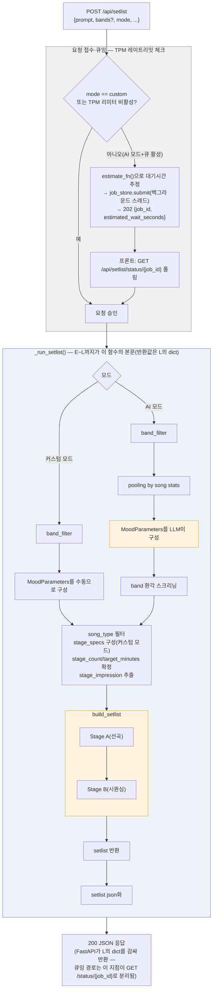
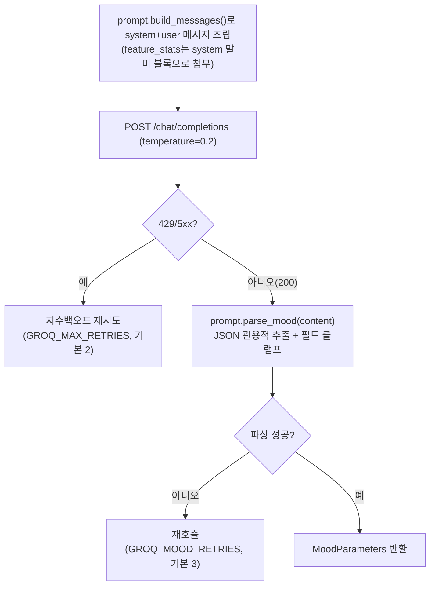

# v2 — 사용자 프롬프트 → 플레이리스트 생성 흐름

> **상태: 배포판 기준 로직 기록.** `src/backend/app/`을 근거로 정리했다. 실제 배포 중인
> 경로는 **단일호출 `GroqMoodInterpreter`**다 — `groq_multistage_adapter`(멀티스테이지)는
> `MOOD_INTERPRETER` 미설정 시 선택되지 않는 미배포 실험 어댑터이므로 이 문서와 무관하다.
> 폴더 버전 규칙은 `archive/version/README.md` 참조 — Patch급 변경은 이 파일을 직접 고쳐
> 반영한다.

## 전체 흐름

## 노드별 설명

### A — `POST /api/setlist`
요청 body: `{prompt, bands?, mode, ...}`. 응답에 `Cache-Control: no-store`.

### INTAKE — 요청 접수·큐잉
- **B**: `mode == "custom"`이거나 TPM 리미터가 비활성이면 즉시 승인.
- **Q**: AI 모드 + 리미터 활성일 때만 진입. `estimate_fn()`으로 대기시간 추정 →
  `job_store.submit()`으로 백그라운드 등록 → `202 {job_id, estimated_wait_seconds}` 반환.
- **QP**: 프론트가 `GET /api/setlist/status/{job_id}`를 폴링해 완료를 확인.

### E — 모드 분기
`payload.mode`로 갈라진다. 두 갈래 모두 목적은 같다 — `MoodParameters`를 만드는 것.

### D1/D2 — `band_filter`
- **D1(커스텀)**: `payload.bands`만.
- **D2(AI)**: `payload.bands ∪ detect_bands(payload.prompt)`. `detect_bands()`는
  `band_aliases.py`의 결정론적 별칭 매칭 — LLM 무관.
- 둘 다 LLM 호출 **이전에** 확정되고, LLM 결과와 무관하게 고정된다.

### E1 — MoodParameters를 수동으로 구성
`payload.stages`(유저가 그래프로 그린 값)를 그대로 `MoodParameters`에 옮겨 담는다.
`honor=True`.

### E2 — pooling by song stats
`pool = band_filter가 적용된 곡 목록`.
- `energy_stats`: `pool`의 `song.energy` 분포(`min/max/mean/std`).
- `feature_stats`: 오디오 6지표(`valence`/`lufs_integrated`/`lra`/`danceability_norm`/
  `instr_stem_ratio`/`speech_median`)의 분포(`min/max/mean/median/std`) — 전체 + 밴드별
  (표본 10곡 미만 밴드는 제외).
- 두 통계는 LLM 호출 시 시스템 메시지에 `[지표 분포 통계]` 블록으로 첨부된다(LLM이 값을
  실제 분포에 근거해 고르게 하는 재료).

### LLM — MoodParameters를 LLM이 구성
실체는 `GroqMoodInterpreter.interpret(prompt, energy_stats, feature_stats)`. 내부 흐름은
아래 "LLM 호출 내부" 절 참고.

### G — band 환각 스크리닝
실체는 `_validate_stage_bands(params.stage_bands, band_names)`.
- LLM이 스테이지별로 지정한 `stage_bands`(자유 텍스트)를 `detect_bands()`로 재해석.
- 정확히 밴드 1개로 좁혀지고 그 밴드가 `band_names`(D2의 근거)에 있을 때만 유효 — 아니면
  `None`(그 스테이지는 밴드 제한 없이 진행).
- 이 검증 직후 `honor=False`로 고정(값을 계산하지 않는 상수 대입 — AI 브랜치에 들어온
  시점에 이미 정해진 사실).

### H — song_type 필터 / stage_specs 구성 / stage_count·target_minutes 확정 / stage_impression 추출
- **song_type 필터**: 사용자 명시값(체크박스)이 LLM `song_type`보다 항상 우선. 기본값
  Original. 커버 판정(`_is_cover()`)은 곡 제목의 `(Cover)`/`(Solo)`/`(feat. …)` 표기 기준.
- **stage_specs 구성(커스텀 모드)**: `payload.stages` → `StageSpec` 리스트. 총 곡수가
  180분 상당을 넘으면 비례 축소.
- **stage_count/target_minutes 확정**: `stage_specs`가 있으면 그로부터 산출, 없으면
  `params.stage_count`(2~11)/`params.target_minutes`(10~180)를 clamp.
- **stage_impression 추출**: `resolve_stage_impression_text()`(스펙 우선 → LLM
  `stage_params.impression` 폴백) → 임베딩 벡터화. 실패해도 해당 스테이지만 중립 처리.

### SEL(`build_setlist`) — Stage A(선곡) → Stage B(시퀀싱)
`domain/selection.py`의 순수 함수(LLM·HTTP 무의존). 내부 로직은 아래 "선곡 로직" 절 참고.

### K — setlist 반환
`Setlist` 객체(`params`, `stages`, `estimated_total_seconds`, `picks`)를 반환.

### L — setlist json화
`serialize_setlist()` + `applied_bands`/`include_original`/`include_cover`/
`honored_overrides` 메타 부가.

### M — 200 JSON 응답
FastAPI가 L의 dict를 감싸 반환. 큐잉 경로(Q/QP)에서는 이 지점이 `GET /status/{job_id}`
응답으로 분리된다 — POST 응답이 아니다.

## LLM 호출 내부(`LLM` 노드)

- 단일 호출(`/chat/completions` 1회) — 멀티스테이지 순차 호출이 아니다.
- 추출 필드: `brightness`, `start_energy`/`end_energy`, `stage_count`, `stage_energies`,
  `stage_minutes`, `stage_bands`, `target_minutes`, `interpretation_summary`, `tags`,
  `song_type`, `stage_params`(6지표 + `impression`).
- 에러 2단: ① HTTP 429/5xx → 지수백오프 재시도 소진 시 `LLMRateLimitError`/
  `LLMUpstreamError`. ② 200이지만 JSON 파싱 실패 → 재호출 소진 시 `MoodInterpretationError`.
  둘 다 폴백값 없이 예외를 그대로 전파(429/502/422로 매핑).
- TPM 예산이 활성이면 HTTP 호출 전에 `TokenBucketLimiter.acquire()`로 선차감.

## 선곡 로직(`SEL` 노드)

이 안에서 후보 풀을 다시 계산한다(`E2`의 `pool`과는 다른 별도 계산 — 에너지허용 밴드 ∧
band_filter 곡). 이 풀이 0건이면 즉시 `NoSetlistError`(409).

**목표 계산**: `params.stage_energies`(있으면 그대로) 또는 `stage_energy_targets()`(선형
보간)로 스테이지별 목표 에너지 산출 → `distribute_counts()`로 스테이지별 곡수 배분 →
`continuous_slot_targets()`로 곡 슬롯 단위 목표까지 세분화.

### Stage A — 선곡(하드 선택)
슬롯마다:
1. 스테이지 고정 밴드가 있으면 최우선 하드필터.
2. `|energy − slot_target| ≤ 0.08`(허용창) 내 후보 중 ①밝기 버킷 근접 ②6지표 거리
   ③가사 임베딩 유사도 순으로 정렬해 선택.
3. 허용창 내 후보가 없으면 허용창 밖 최근접을 채택하되, 편차가 0.16을 넘으면 그 슬롯은
   스킵(결과 곡 수가 목표보다 적어질 수 있음 — 에러 아님).

밝기 버킷(1순위)은 연속값이 아니라 이산 버킷(`_BRIGHTNESS_BUCKET=0.25`)이다. 6지표는
`stage_params`가 자주 비어(`0.0` 중립 반환) 정렬 기준이 무너지기 쉬운 반면, 밝기(곡의
`mode_score`/`shape` 파생값)는 항상 채워지므로 안정적인 1순위로 쓴다. 6지표에 "energy"는
없다 — 에너지는 별도 축(허용창)이 이미 1차 필터로 담당한다.

### Stage B — 시퀀싱(곡 순서 배치)
`_sequence_by_continuity()` — 곡 경계 텐션(이전 곡 아웃트로 ↔ 다음 곡 인트로) 최소화
그리디 체인:
- 시드곡: 스테이지 첫 곡이면 인트로 텐션이 가장 높은 후보(오프너 룰), 아니면 이전 곡
  아웃트로 + 슬롯 목표 종합.
- 이후 각 슬롯: `cost = 경계갭 + 0.15(비하모닉 페널티) + 1.5×슬롯목표 이탈`. 최소비용 후보
  + 0.05 슬랙 이내에서 랜덤 선택.
- 스테이지 크기 40 이하면 2-opt 스왑으로 국소 개선.

## 에러/폴백 요약

| 상황 | 결과 |
|---|---|
| Groq 429/5xx, 재시도 소진 | `LLMRateLimitError`(429) / `LLMUpstreamError`(502) |
| 200이지만 무드 JSON 파싱 끝내 실패 | `MoodInterpretationError`(422) |
| Stage A 후보 부족(허용창 밖도 0.16 초과) | 해당 슬롯만 스킵 |
| 밴드 필터 결과 후보 0건 | `NoSetlistError`(409 NO_SETLIST) |
| 가사 임베딩 실패 | 해당 스테이지만 중립 처리, 선곡은 계속 진행 |

## 관련

- 코드 위치: `src/backend/app/api/routes.py`, `src/backend/app/adapters/groq_adapter.py`,
  `src/backend/app/adapters/prompt.py`, `src/backend/app/domain/selection.py`,
  `src/backend/app/domain/models.py`.
