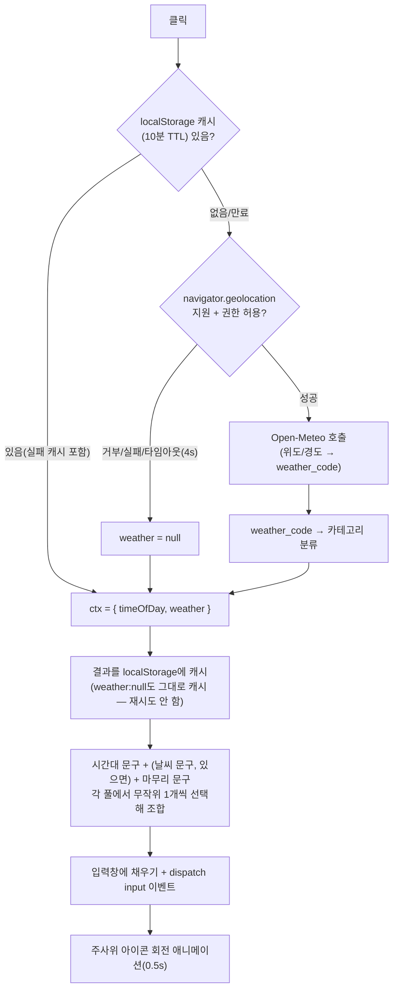

# v2 — 오마카세 버튼 로직

> **상태: 배포판 기준 로직 기록.** `archive/last-papers/reports/2026-08-11-omakase-button-logic.md`
> (PR #66, `feature/omakase-prompt-button` 브랜치에서 작성)의 내용을 그대로 이어받아 이
> `version/v2/` 묶음에 재수록한다 — 그 문서는 기능 단위 기록(last-papers 티어)이고, 이
> 문서는 "현재 배포판이 쓰는 로직" 묶음(version 티어)이라는 위치만 다르다. 세부 표·근거는
> 원본 문서가 더 상세하니 갱신이 필요하면 원본을 우선 고친다.

AI 모드 프롬프트 입력창 우측의 🎲 오마카세 아이콘 버튼. 클릭 시 시간대·날씨를 조합해
프롬프트 문구를 자동 생성해 입력창에 채운다(자동 제출은 하지 않음).

## 흐름

같은 페이지 안에서 연타해도 인메모리 프라미스(`omakaseCtxPromise`)가 진행 중인 fetch 하나만
공유하게 해 중복 요청을 막는다(`app.js:156`). TTL 캐시는 별도로 `localStorage`가 담당한다.

## 시간대 분류 (`omakaseTimeOfDay`, `app.js:114-120`)

| 시간(로컬) | 구간 키 |
|---|---|
| 05:00–07:59 | `dawn` (새벽) |
| 08:00–10:59 | `morning` (아침) |
| 11:00–16:59 | `afternoon` (오후) |
| 17:00–20:59 | `evening` (저녁) |
| 21:00–04:59 | `night` (밤) |

## 날씨 분류 (`omakaseWeatherCategory`, `app.js:122-129`, Open-Meteo `weather_code` 기준)

| WMO 코드 범위 | 카테고리 |
|---|---|
| 0 | `clear` (맑음) |
| 1–3, 45, 48 | `cloudy` (흐림/안개) |
| 51–67, 80–82 | `rain` (비) |
| 71–77, 85–86 | `snow` (눈) |
| 95 이상 | `storm` (뇌우) |
| 그 외 | `null` (문구에서 날씨 절 생략) |

## `getOmakaseContext()` 실행 순서 (`app.js:157-182`)

1. `ctx = { timeOfDay: omakaseTimeOfDay(현재시각), weather: null }` 즉시 계산.
2. localStorage 캐시가 유효하면(TTL 내, 실패 캐시 포함) 그대로 반환하고 API 호출 스킵.
3. `navigator.geolocation` 미지원 시 시간대만 있는 ctx 반환.
4. `getCurrentPosition`으로 좌표 획득(4초 타임아웃).
5. Open-Meteo `current=weather_code` 호출 → 분류 → `ctx.weather` 세팅.
6. 위치/날씨 조회 실패 시 catch에서 무시하고 시간대만으로 폴백.
7. 성공/실패와 무관하게 `writeOmakaseWeatherCache()`로 캐시 갱신 후 ctx 반환.

## 클릭 이벤트 순서 (`app.js:194-209`)

1. `track("omakase_click")` 로깅.
2. `omakaseBtn.disabled = true`.
3. `rolling` 클래스 제거 → `offsetWidth` 강제 리플로우(연타 시 애니메이션 재시작 보장) →
   `rolling` 클래스 재추가.
4. `await getOmakaseContext()`로 컨텍스트 획득.
5. `buildOmakasePrompt(ctx)` 결과를 입력창에 채우고 `input` 이벤트 디스패치.
6. `finally`에서 버튼 재활성화. `animationend` 리스너가 별도로 `rolling` 클래스를 제거.

## `buildOmakasePrompt(ctx)` 조합 로직 (`app.js:184-192`)

랜덤 조합: `ctx.weather`가 있고 해당 문구셋이 있으면 `pickRandom(날씨문구)` 추가 →
`pickRandom(시간대문구)` 필수 추가 → `pickRandom(마무리문구)` 필수 추가 → 공백으로 join.
날씨가 없으면 시간대+마무리 2개만 조합. 문구 풀·예시·API 남용 방지 설계(인메모리
프라미스 + localStorage TTL) 표는 원본 문서(`archive/last-papers/reports/
2026-08-11-omakase-button-logic.md`)에 더 상세히 정리돼 있다.

## 관련

- 원본 상세 기록: `archive/last-papers/reports/2026-08-11-omakase-button-logic.md`(문구 풀
  전체 표, API 남용 방지 설계 표 포함).
- 코드 위치: `src/frontend/app.js` (`OMAKASE_TIME_PHRASES`/`OMAKASE_WEATHER_PHRASES`/
  `OMAKASE_SUFFIXES` 상수, `omakaseTimeOfDay`/`omakaseWeatherCategory`/
  `getOmakaseContext`/`buildOmakasePrompt`/클릭 핸들러).
