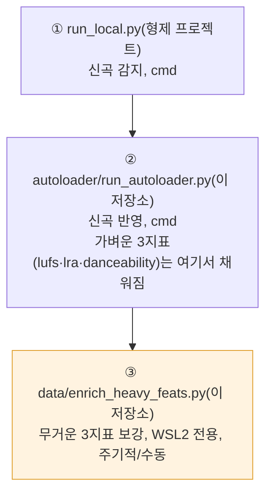
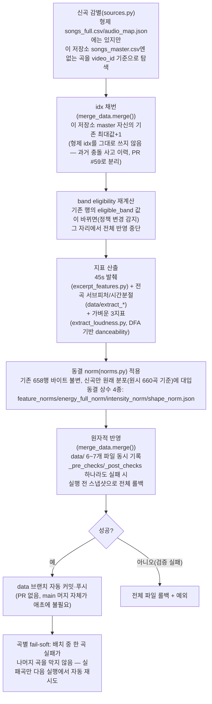
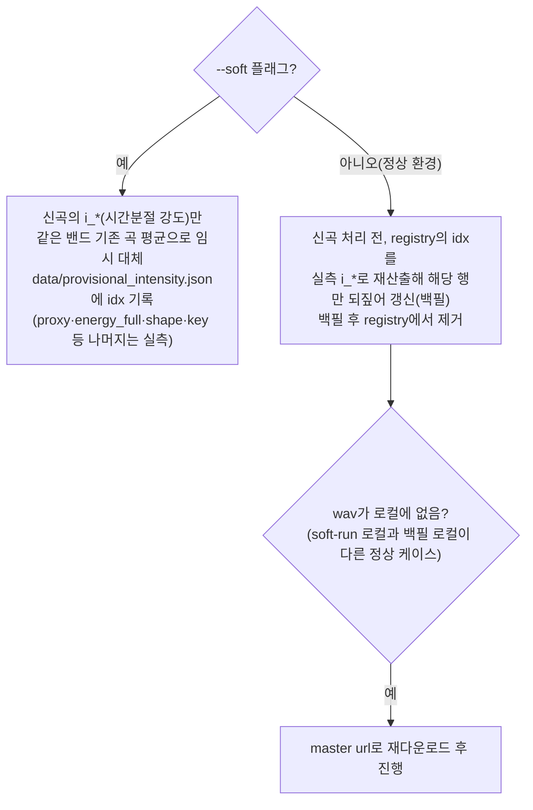

# v2 — semi-autoloader(신곡 오토로더) 작동 로직

> **상태: 배포판이 소비하는 데이터의 생산 경로 기록.** 이 로직 자체는 `main`이 아니라
> `tools` 브랜치(`auto-loader/`, `main`에는 절대 머지되지 않는 상시재사용 단일 브랜치)에
> 있지만, 배포된 백엔드가 서빙하는 `data/songs_master.csv`가 어떻게 만들어지는지는
> "배포판이 사용 중인 기능"의 전제 조건이라 이 묶음에 함께 기록한다. 근거:
> `tools:auto-loader/README.md`(2026-08-03 확정 운영 순서 기준).

**감지는 형제 프로젝트(bandori-song-sorter) Actions가 전담**하고, 이 저장소의 오토로더는
"형제 origin/main에 반영된 곡"과 "이 저장소 `data` 브랜치 `songs_master.csv`"의 차이만
처리한다. yt-dlp 다운로드가 데이터센터 IP를 봇월에 막혀 **집 IP 로컬 실행이 필요**해서
cron 완전자동이 아니라 사람이 트리거하는 반자동 툴이다.

## 전체 운영 순서 (3단계, ①·②는 cmd, ③만 가끔 WSL2)

무거운 3지표(`valence_median`·`instr_stem_ratio`·`speech_median`)는 ②에서 항상 빈 칸으로
남는 게 **의도된 동작**이며, ③이 멱등하게(이미 채워진 행은 건드리지 않음) 나중에 채운다.

## ② autoloader/run_autoloader.py — 신곡 1곡이 반영되는 과정

- **검증 항목**(`_pre_checks`/`_post_checks`): video_id/idx 유일성, camelot 매핑 성공, 기존
  행 바이트 불변, append 파일이 기존 내용의 순수 연장인지("append-only, 기존 바이트 불변"
  원칙).
- **재실행 안전**: video_id 기준 감별이라 멱등, 실패 곡은 다음 실행에서 자동 재시도.

## `--soft` 모드 (부분 wav 환경 긴급 반영)

`intensity_norm` 부트스트랩은 원본 **전곡** wav를 요구해, wav 캐시가 부분적인 로컬(예:
285/660곡)에서는 신곡 반영이 통째로 막힌다.

운영 시나리오: **타 로컬에서 `--soft`로 일단 곡 반영 → 원본 wav 있는 메인 로컬에서 일반
run으로 정밀 산출값까지 마무리.**

## ③ data/enrich_heavy_feats.py — 무거운 3지표 주기적 보강

- **목표**: `songs_master.csv`의 `m6-valence_median`(감정 밝기), `m9-instr_stem_ratio`
  (보컬/악기 비중), `m11-speech_median`(음절 밀도)을 실측값으로 보강.
- **의존성**: essentia-tensorflow, librosa, scipy, torch — **WSL2 전용**(Debian PEP 668로
  venv 필수). 없으면 fail-soft로 안내 후 조용히 종료.
- 신곡마다 매번 돌릴 필요 없이, 밀린 곡이 쌓이면 가끔 실행(멱등 — 이미 채워진 행은 건드리지
  않음).

## 배포판과의 연결

이 오토로더가 `data` 브랜치에 push하면, 배포된 백엔드(`src/backend/app/repo/
remote_source.py`)는 **기동 시 + 주기 리프레시(기본 30분) + 관리자 강제 리프레시
엔드포인트**(`POST /api/admin/refresh-data`, 오토로더가 push 직후 호출 시도) 셋 중 하나로
새 데이터를 원격 fetch해 반영한다. `main` 재배포는 전혀 발생하지 않는다(설계 의도: 신곡
추가가 서비스 슬립/재배포를 유발하지 않게 하기 위함). 이 부분의 상세 시퀀스는
`archive/last-papers/reports/2026-07-29-request-flow-diagrams.md`의 2번(백그라운드 주기
루프)·4c(관리자 강제 리프레시) 절 참조.

## 코멘트 Q&A (2026-08-11)

### mutype 신곡(오전 9시경 YouTube Music 업로드)을 감지기가 놓쳤다 — YT Music 전용이라 그런가, RSS 실패인가?

감지는 밴드별 **"`<Band> - Topic`" 자동생성 채널**의 RSS(`youtube.com/feeds/videos.xml?
channel_id=...`)를 폴링하는 방식이다(`bandori-song-sorter:src/tools/collect/
youtube_rss.py`, `BAND_CHANNELS["mugendai_mutype"]`). 이 Topic 채널은 YouTube의 Content ID가
공식 음원으로 인식한 콘텐츠를 **일반 YouTube 업로드든 YouTube Music 전용 릴리스든 관계없이**
자동으로 채워 넣는 구조라, "YT Music에만 있어서 원천적으로 못 잡는다"는 아니다 — 다만 릴리스
시점부터 이 Topic 채널 RSS 항목에 실제로 반영되기까지 **전파 지연(수 시간 단위, 드물게 더
걸릴 수 있음)**이 있는 게 알려진 특성이다. 감지는 `pipeline.yml`(하루 1회, 23:00 KST 크론)
이 도니, "오전 9시 업로드 → 그날 23시 실행 시점엔 아직 Topic 채널에 안 뜬 상태"였다면 다음 날
실행에서 잡히는 게 정상 경로다.

**정정: "직접 쿼리해봤다"는 저장소 소유자의 PC가 아니라 이 세션(Claude Code)이 도는
클라우드 샌드박스에서였다** — 사람이 자기 컴퓨터로 확인한 게 아니라, AI 에이전트가 자신의
실행 환경(데이터센터/클라우드 IP)에서 같은 RSS URL을 호출해본 것이다. `mugendai_mutype`뿐
아니라 테스트한 모든 밴드 채널이 404를 반환했는데, 이건 이 프로젝트가 이미 알고 있는 문제
(`CLAUDE.md`/오토로더 문서의 "데이터센터 IP가 YouTube 봇월에 막힘")와 같은 계열의 환경
제약으로 보인다 — 즉 **사람이 집 IP로 직접 쿼리했다면 정상 응답이 왔을 가능성이 높고**,
저장소 소유자가 언급한 "예전에도 비슷한 일이 있었는데 나중에 시도하니 됐다"는 경험과도
결이 같다(그것도 이번처럼 YouTube 쪽의 일시적 응답 이슈였을 공산이 크다). 이 세션의 404는
채널ID 문제인지 진짜 부재인지조차 구분할 수 없는, **증거로 쓸 수 없는 결과**였다는 뜻이다.
**직접 확인하려면 집 IP 로컬에서** `python src/tools/collect/youtube_rss.py --show`(현재
피드에 그 영상이 있는지)와 `--audit`(variant/length 휴리스틱으로 잘못 걸러졌는지)를
실행해봐야 한다. 참고로 `data` 브랜치 최신 커밋(`eed637a`, 2026-08-07 20:28)이 mutype
신곡(`一番のひかり`) 자동 반영이라, 파이프라인 자체는 최근까지 정상 동작한 이력이 있다 —
이번 건만의 개별 지연/누락일 가능성이 높다.

### 오디오 없는 서브 로컬에서 ②(run_autoloader.py)를 돌려도 되나?

**된다.** 기존 733행(원본 660 + 그간 자동반영분)의 동결 norm 상수(`feature_norms.json` 등
4종)는 이미 `data` 브랜치에 커밋돼 있어 **기존 카탈로그의 오디오를 다시 읽을 필요가
없다** — 신곡 자신의 오디오만 있으면 된다. 그리고 신곡 오디오는 `fetch_new.py`가 yt-dlp로
**자동 다운로드**하므로 로컬에 사전 캐시가 없어도 진행된다. 유일한 전제는 "집(레지덴셜) IP"
라는 점뿐 — 이건 어느 로컬이든 IP 성격의 문제지 오디오 캐시 유무와 무관하다. 예외적으로
`--soft` 없이 정상 실행할 때 "백필 대상 registry"에 남아있는 옛 곡이 있으면 그 곡의 wav를
찾다가 없으면 마스터 URL로 재다운로드하는 추가 단계가 붙지만, 이것도 실패가 아니라
자동으로 처리된다(위 `--soft` 절 참조).

### WSL2가 필요한 ③(enrich_heavy_feats.py)도 서브 로컬에서 돌려도 되나?

**WSL2 자체는 문제없지만, ②와 달리 자동 다운로드가 없다는 차이를 알아야 한다.** ③은
`--audio-dir`에서 로컬 wav 캐시를 찾기만 하고(`enrich_heavy_feats.py:12` 주석, 507번째 줄
근처), 없으면 **에러 없이 조용히 `[SKIP] 오디오 없음`으로 건너뛴다**(fail-soft) — ②의
`fetch_new.py`처럼 yt-dlp로 대신 받아오지 않는다. 즉:
- **②를 방금 돌린 그 로컬**에서 이어서 ③을 돌리면 문제없다(신곡 wav가 다운로드 캐시에
  남아있음).
- **②를 돌린 로컬과 다른 서브 로컬**에서 ③만 따로 돌리면, 그 신곡의 wav가 없어 **조용히
  스킵되고 아무것도 채워지지 않는다** — 실패 로그를 자세히 보지 않으면 "다 됐다"고 착각하기
  쉬운 지점이다. 다른 로컬에서 돌릴 계획이면 먼저 그 로컬에 해당 신곡 wav를 받아두거나
  (`--audio-dir`로 공유 캐시 경로를 지정), 오디오 전체가 있는 메인 로컬에서 도는 게 안전하다.

### 지금까지 추가된 신곡 중 WSL2 산출값(무거운 3지표)이 다 채워졌나? 안 채워지면 선곡이 안 되나?

`data` 브랜치 `songs_master.csv`(2026-08-11 기준, 총 733행) 확인 결과 **`m6-valence_median`/
`m9-instr_stem_ratio`/`m11-speech_median` 중 하나라도 빈 행은 딱 1개**(`idx=734`, 가장 최근
자동반영분인 `一番のひかり`, 2026-08-07 커밋) — 그 이전 자동반영분은 전부 채워져 있다. 즉
③이 밀리지 않고 잘 따라가고 있다는 뜻이다.

**안 채워져도 선곡 자체는 막히지 않는다.** Stage A의 6지표 거리(`_stage_param_distance()`,
`selection.py:314-322`)는 **곡별로** 값이 없는 필드만 건너뛰고 나머지 필드로 평균을 낸다 —
전부 없으면 0.0(중립)일 뿐, 그 곡을 후보에서 제외하지 않는다. 위 01번 문서의 "밝기 버킷"
질문 답변과 같은 이유로, 애초에 6지표는 "정렬 2순위 타이브레이크"라 없어도 안전하게
동작하도록 설계돼 있다(밝기 버킷·에너지 허용창이 1순위 하드필터를 담당). 신곡이 잠깐
무거운 3지표 없이 서빙돼도 선곡 품질이 조금 덜 세밀할 뿐, 선곡 자체가 실패하지는 않는다.

## 관련

- 코드/문서 위치: `tools` 브랜치 `auto-loader/README.md`,
  `auto-loader/autoloader/{sources,merge_data,fetch_new,excerpt_features,norms}.py`,
  `auto-loader/data/enrich_heavy_feats.py`.
- 감지 원본(형제 저장소 `bandori-song-sorter`): `src/tools/collect/youtube_rss.py`
  (Topic 채널 RSS 폴링 + PR 게이트), `.github/workflows/pipeline.yml`(일 1회 23:00 KST
  크론, `src/tools/semiauto-loader/orchestrate.py --detect-only --notify` 호출, Telegram
  `/pause`·`/resume`로 일시정지 가능).
- 과거 상세 기록: `archive/last-papers/reports/2026-07-15-song-autoloader-shape-fix-and-norm-methodology.md`.
