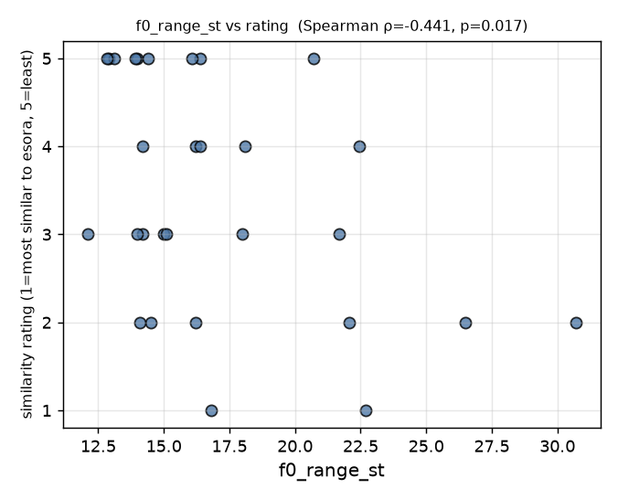
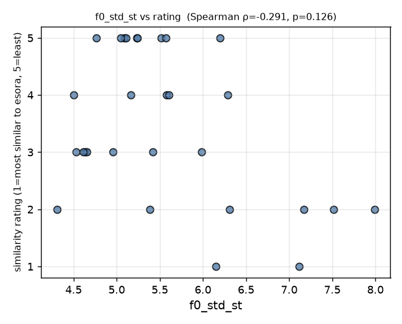
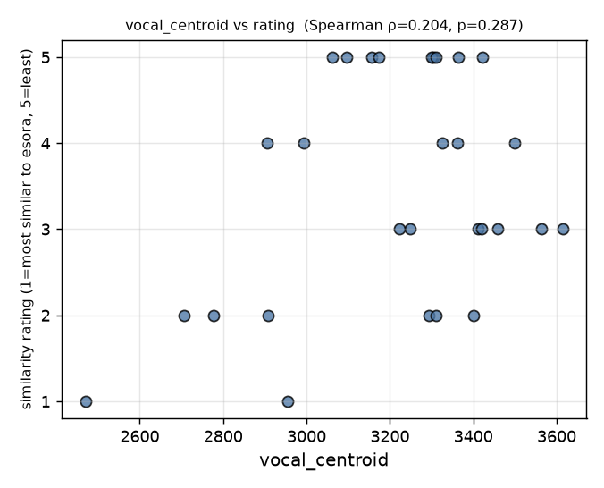

# Warmth/Pathos Vocal Feature Analysis — Results (n=29)

- Analysis rows (labeled, idx97 excluded): **n=29**
- Anchors excluded from stats: esora(208), Sonorous(196), 天球(78)
- Corpus for z-scores/incongruence: 660 songs (mode_score μ=0.0271 σ=0.1685; centroid μ=2720.81 σ=261.37)

## 1. Baseline reproduction check

6-feature baseline (dist, mode_score, harmonic_ratio, contrast, rms, voiced_frac_mix) OLS on rating:
- **R² = 0.2283**  (target 0.228, MATCH)

## 2/3/4/5/6. Per-feature results

| feature | Spearman ρ | p | q(BH) | Pearson r | partial ρ (Sp) | partial r (Pe) | ΔR² | verdict |
|---|---|---|---|---|---|---|---|---|
| jitter_local | -0.191 | 0.320 | 0.721 | -0.211 | -0.124 | -0.073 | 0.0162 | 기각 |
| shimmer_local | -0.049 | 0.801 | 0.901 | -0.005 | -0.032 | 0.090 | 0.0028 | 기각 |
| hnr_mean | -0.007 | 0.971 | 0.971 | -0.126 | 0.049 | -0.200 | 0.0412 | 기각 |
| f0_median_st | 0.111 | 0.567 | 0.851 | 0.107 | 0.018 | -0.010 | 0.0000 | 기각 |
| f0_range_st | -0.441 | 0.017 | 0.149 | -0.419 | -0.301 | -0.300 | 0.0777 | 시사적 |
| f0_std_st | -0.291 | 0.126 | 0.566 | -0.426 | -0.186 | -0.313 | 0.0927 | 기각 |
| vocal_ratio | 0.062 | 0.749 | 0.901 | -0.162 | 0.025 | -0.264 | 0.0413 | 기각 |
| vocal_centroid | 0.204 | 0.287 | 0.721 | 0.352 | 0.080 | 0.277 | 0.0657 | 기각 |
| incongruence | -0.158 | 0.414 | 0.746 | -0.111 | -0.102 | -0.175 | 0.0124 | 기각 |

Notes: Spearman is the primary test; partial correlations control mode_score + voiced_frac_mix (residual method). ΔR² = increment over the 6-feature baseline when the single feature is added (n=29, not all 9 together). q = Benjamini-Hochberg FDR over the 9 Spearman p-values.

Verdict rule: |Spearman ρ|≥0.5 (p<.05) AND |partial ρ|≥0.4 → 채택 후보; 0.37≤|ρ|<0.5 → 시사적; else 기각.

### Hierarchical increment detail

| feature | R²(base+feat) | ΔR² | p(increment F) |
|---|---|---|---|
| jitter_local | 0.2445 | 0.0162 | 0.509 |
| shimmer_local | 0.2311 | 0.0028 | 0.783 |
| hnr_mean | 0.2695 | 0.0412 | 0.289 |
| f0_median_st | 0.2283 | 0.0000 | 0.972 |
| f0_range_st | 0.3059 | 0.0777 | 0.140 |
| f0_std_st | 0.3210 | 0.0927 | 0.105 |
| vocal_ratio | 0.2695 | 0.0413 | 0.288 |
| vocal_centroid | 0.2940 | 0.0657 | 0.177 |
| incongruence | 0.2407 | 0.0124 | 0.564 |

## 7. Anchor table (raw value + percentile within n=29)

| feature | esora(208) | pct | Sonorous(196) | pct | 天球(78) | pct |
|---|---|---|---|---|---|---|
| jitter_local | 0.012 | 17 | 0.009 | 0 | 0.012 | 17 |
| shimmer_local | 0.096 | 17 | 0.087 | 10 | 0.085 | 10 |
| hnr_mean | 13.609 | 83 | 14.815 | 93 | 14.176 | 93 |
| f0_median_st | 65.287 | 29 | 66.587 | 52 | 65.287 | 29 |
| f0_range_st | 21.200 | 79 | 17.200 | 69 | 22.100 | 86 |
| f0_std_st | 5.271 | 48 | 6.839 | 86 | 5.823 | 69 |
| vocal_ratio | 0.374 | 28 | 0.420 | 66 | 0.502 | 86 |
| vocal_centroid | 3214.560 | 38 | 2934.415 | 17 | 3143.840 | 31 |
| incongruence | 0.866 | 38 | 0.623 | 34 | 1.092 | 45 |

## 8. Scatter plots (top-3 by |Spearman ρ|)

