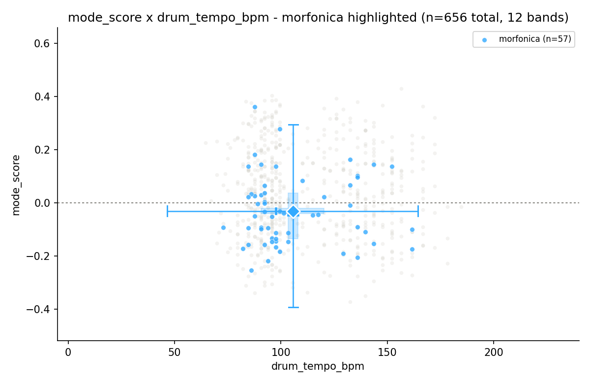
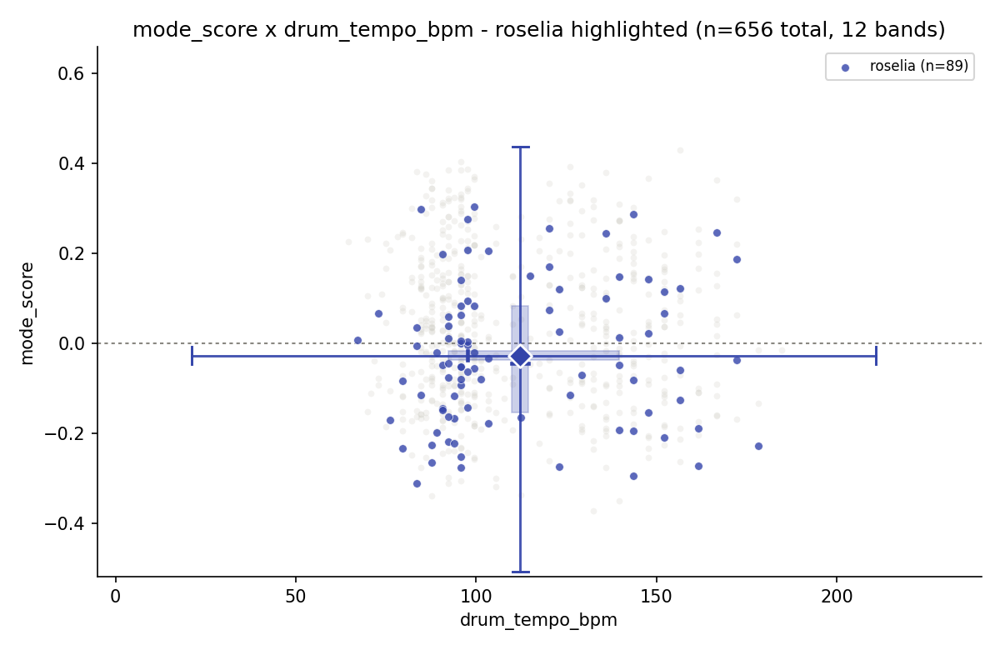
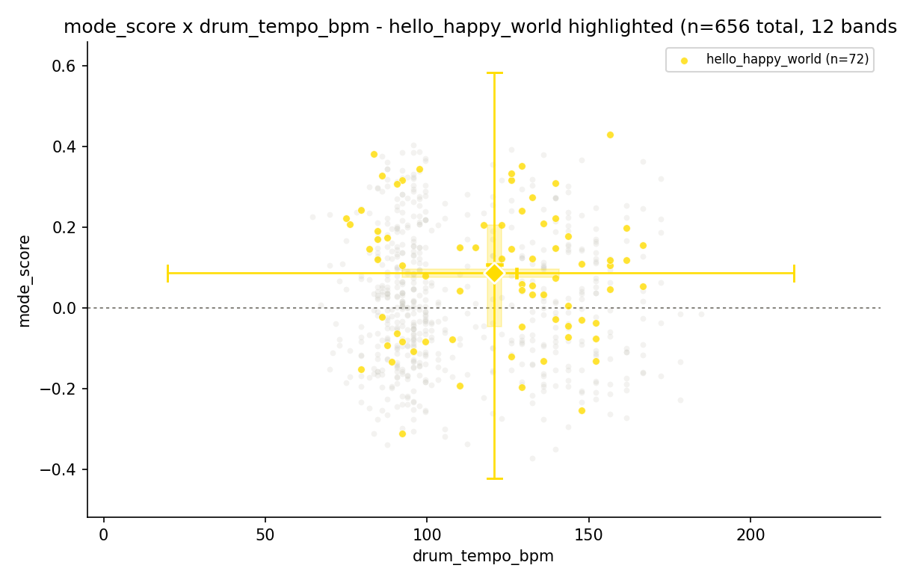
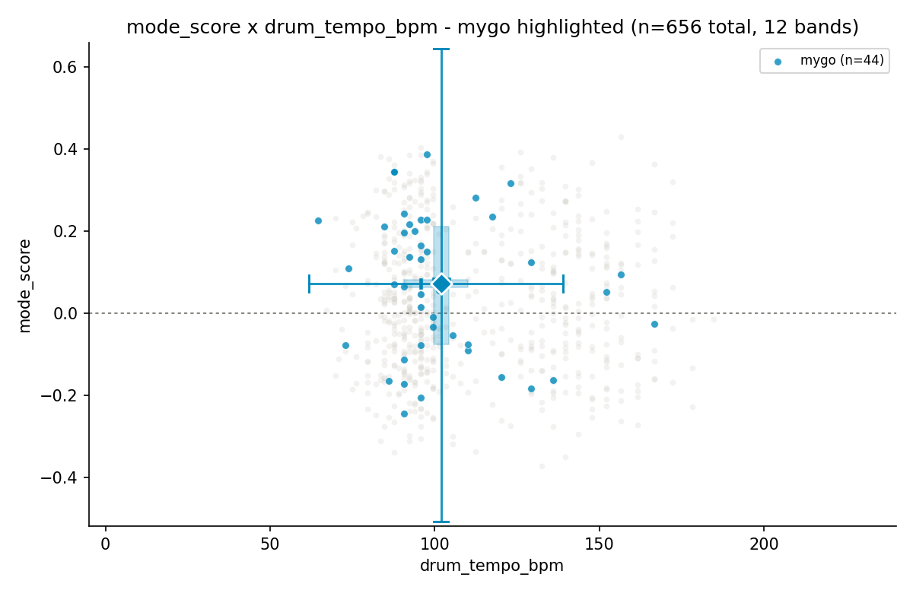

# mode_score × 템포 산점도로 본 밴드 무드 축 + 템포 데이터 QC

`report/03`(전체 피쳐 분포 스캔)에서 밴드가 조성(`mode_score`)·음색(MFCC)·에너지 지표에
뚜렷한 신호를 남긴다는 걸 확인한 뒤, "bright↔dark 무드 지표를 뽑을 수 있는가"라는 질문에서
출발해 `mode_score`(y) × 템포(x) 밴드별 산점도를 만들어본 결과다. 오디오 재처리 없음 —
기존 CSV(`out/audio_feats.csv`, `out/bpm_final.csv`)만 사용.

## 1. 배경 — 왜 이 두 축인가

형제 프로젝트(`bandori-song-sorter`)의 `emotion-axes-extraction.md`(Phase C) 연구에서 이미
Russell circumplex(valence-arousal) 모델을 이 카탈로그에 검증한 바 있다:

- **Valence(밝음/어두움) = `mode_score`**로 확정(손라벨 상관 r=+0.576)
- **Timbre = `contrast`**로 확정(r=−0.815)
- **Arousal(활력) 독립 축은 없음** — 오디오 측정 BPM이 지각 빠르기와 무관(r=+0.087)했고,
  지각 에너지/빠르기는 실제로 timbre(contrast) 축에 얹혀 있었다

즉 "밝음↔어두움"을 음악적으로 보면 `mode_score`가 이미 검증된 지표다. 이번 세션은 이걸
템포와 나란히 놓고 밴드별 분포·이상치를 직접 시각화했다.

## 2. 방법

- **12개 밴드 전부 개별 토글**(various_artists만 제외 — 표본 5곡이 여러 아티스트 혼합이라
  밴드 정체성 자체가 성립 안 함). 초기에는 카테고리 팔레트 CVD 안전 한도(8색) 때문에 소수
  밴드를 "Other"로 묶었으나, 이후 요청에 따라 전부 개별화했다.
- **점·중심 색은 형제 프로젝트(`bandori-song-sorter`)의 `BAND_COLORS`**(밴드 퍼스널 컬러,
  `static/js/functions/15-wordcloud.js`, "HANDOFF #2 확정") 그대로 사용 — 디자인 시스템의
  CVD-안전 팔레트가 아니라 실제 밴드 아이덴티티 색이며, 검증된 팔레트가 아니므로 색만으로
  완전히 구분되진 않는다(mygo·roselia·morfonica·raise_a_suilen이 모두 파랑~시안 계열).
  구분은 토글·hover 툴팁·중심 아이콘에 의존.
  (실수 기록: 처음엔 밴드 에셋 PNG에서 직접 평균색을 뽑았는데 배경/그림자가 섞여 탁한
  회갈색이 나왔고, 이후 확인 결과 이미 확정된 공식 매핑이 별도로 존재해 그걸로 교체했다.)
- **밴드 중심 마커 = 밴드 에셋 아이콘**(`bandori-pipeline/assets/bands/*.png`, 원형 클리핑)
  + 대표색 링
- 밴드별 x/y 각각 Tukey box-and-whisker arm(`min=Q1−1.5×IQR`, `max=Q3+1.5×IQR`, 반투명
  박스=Q1~Q3, 굵은 선=median). **`final_bpm` 버전은 arm 통계를 bestdori 공식 매칭곡만으로
  계산**(추정치곡은 점만 표시, 통계에는 미반영) — 공식 매칭곡이 0곡인 mugendai_mutype·
  ikka_dumb_rock·millsage는 중심/arm 자체가 생략된다.
- Tukey fence 밖 곡은 이상치로 표시
- 밴드 토글(ON/OFF, 하나라도 ON이면 OFF된 밴드는 opacity 0.05로 강하게 흐려짐), hover 정보
  (ON 밴드만), 클릭 시 유튜브 링크 오픈(hover 시 곡 이름 표시, 원본 오디오 파일명 아님)
- 1차: x=`drum_tempo_bpm`(원본 신호 추정치) — `fig/scatter_mode_tempo_band.html`
- 2차: x=`final_bpm`(bestdori 공식 573곡 + 추정 88곡, method-2 결론 반영) — `fig/scatter_final_bpm_band.html`,
  공식 매칭곡=채워진 원, 추정치곡=빈 원(테두리만)으로 구분

## 3. 결과

### 3.1 밴드는 mode_score 축에서 뚜렷하게 두 그룹으로 갈린다
밴드별 평균 mode_score 기준:
- **밝음(장조 우세)**: afterglow, hello_happy_world, mygo, pastel_palettes, poppin_party
- **어두움(단조 우세)**: roselia, raise_a_suilen, morfonica, ave_mujica

y=0 근처에서 거의 정확히 이 두 그룹으로 갈라진다 — `report/03`에서 이미 확인한 단조 비율
(afterglow 30.6% ~ morfonica 63.2%)과 일치하는 결과다. 아래는 대표적으로 어두운 밴드
(morfonica·roselia)와 밝은 밴드(hello_happy_world) 하이라이트 예시다(그 외 밴드는
인터랙티브 HTML에서 토글로 확인):

| morfonica (어두움) | roselia (어두움) | hello_happy_world (밝음) |
|---|---|---|
|  |  |  |

### 3.2 템포와 조성은 독립적인 축이다
밴드별 `drum_tempo_bpm`↔`mode_score` 상관계수가 전부 |r|<0.17 — "빠른 곡=밝다"는 통념이
이 데이터에선 성립하지 않는다. 이는 형제 프로젝트의 "Arousal 독립 축 없음" 결론과도 결이
맞는다: 템포는 밴드 무드 정체성에 거의 관여하지 않는다.

### 3.3 Tukey fence 이상치 (12밴드 개별화 후 기준)
**drum_tempo_bpm 기준(4곡)**:
| 밴드 | 곡 | 이상 축 |
|---|---|---|
| mygo | 影色舞 / 輪符雨 / 猛独が襲う (Cover) | 템포(밴드 평균보다 훨씬 빠름) |
| morfonica | The Circle Of Butterflies | 조성(밴드 평균보다 훨씬 장조 쪽) |

**final_bpm 기준, arm을 공식 매칭곡만으로 재계산한 뒤(6곡)**:
| 밴드 | 곡 |
|---|---|
| roselia | 軌跡 |
| pastel_palettes | ハナヒバナ / 奏（かなで） (Cover) |
| hello_happy_world | はれやか すこやか ぴかりんりん♪ / GO! GO! MANIAC (Cover) |
| morfonica | The Circle Of Butterflies |

various_artists를 완전히 제외하면서 "Here, the world" 이상치는 데이터셋에서 사라졌다.
arm을 공식 매칭곡만으로 좁히자(추정치 노이즈 제거) 오히려 이상치 수가 늘었는데, 이건
분포가 더 좁게(정확하게) 잡히면서 fence 자체가 좁아졌기 때문 — 노이즈가 줄어든 게 아니라
"정상 범위"의 정의가 더 엄격해진 결과다.

### 3.4 morfonica 이상치는 진짜 음악적 이상치가 아니라 **템포 데이터 결함**이었다 ★
`The Circle Of Butterflies`를 직접 청취 검증한 결과, `drum_tempo_bpm`(87.6)이 실제 템포(174)의
**정확히 절반**이었다 — 고전적인 옥타브 오류다. `bpm_final.csv`에는 이미 bestdori 공식값(174,
`bpm_source=official`)으로 정정돼 있었지만, 1차 산점도(§2의 1차 버전)는 `drum_tempo_bpm`을
그대로 썼기 때문에 잘못된 x좌표(87.6)에 찍혀 있었다.

**의도치 않은 효과**: mode_score 축 이상치 탐지가 결과적으로 "이 곡의 raw 템포 추정이 틀렸다"는
걸 청취 검증 전에 통계적으로 먼저 걸러냈다 — method-2(report/02)에서 확정된 잔여 오차(Accuracy1
92.5%, 즉 7.5%는 여전히 틀림)가 실제 사례로 재확인된 것이다.

mygo의 템포 이상치 3곡(§3.3)도 함께 보면:

이 발견 이후 x축을 `final_bpm`(bestdori 우선)으로 바꾼 2차 산점도를 추가했다 — 데이터 자체를
고치진 않았지만(요청에 따라 원본 `audio_feats.csv`는 유지), 어느 지표를 분석에 쓸지는 이 결과에
따라 바뀔 수 있다. 2차 버전에서는 morfonica의 이 곡이 템포 축 이상치에서는 빠지고(174로 정정
반영), mode_score 축 이상치로만 남는다 — 원래 의도한 순수한 "조성 이상치"로 정리된다.

## 4. 결론

1. **`mode_score`는 이 카탈로그에서 밴드 무드(밝음/어두움) 축으로 실제로 유효하다** — 형제
   프로젝트의 손라벨 검증(r=+0.576)과 이번 밴드별 분포 양쪽에서 일관되게 확인됨.
2. **템포 기반 독립 무드 축은 없다** — 밴드 내 상관 |r|<0.17, 형제 프로젝트의 arousal 축
   기각과 일치. "밝음↔어두움"은 mode_score(조성), "격렬함"은 timbre(contrast) 계열로 가야 함.
3. **이상치 시각화는 QC 도구로도 작동한다** — 통계적 이상치가 항상 "흥미로운 음악적 특이점"은
   아니고, 이번처럼 "잘못된 측정값"을 가리킬 수 있다. 특히 템포처럼 이미 알려진 신뢰도 한계
   (report/01, report/02)가 있는 지표를 분석축에 쓸 때는 원본 신호값(`drum_tempo_bpm`)보다
   검증된 최종값(`final_bpm`)을 쓰는 편이 안전하다.
4. mygo의 템포 이상치 3곡은 실제로 밴드 평균보다 훨씬 빠른 곡들로, 이전에 확인한 "mygo는
   RMS 최고/energy_full 최저"라는 다이나믹 대비 특성과 연결될 가능성이 있다(미검증, 후속 과제).

## 5. 산출물
- `fig/scatter_mode_tempo_band.html` — 1차, x=drum_tempo_bpm(원본 신호), 12밴드 개별 토글
- `fig/scatter_final_bpm_band.html` — 2차, x=final_bpm(bestdori 기준), 공식/추정 원 구분,
  arm은 공식 매칭곡만으로 계산
- `fig/scatter_band_{밴드명}.png` × 12 — 밴드별 정적 하이라이트 버전(drum_tempo_bpm 기준,
  밴드 퍼스널 컬러 적용)
- `fig/feature_distributions_grid.png`, `fig/feature_distributions_by_band.png` — report/03 산출물(참조)
