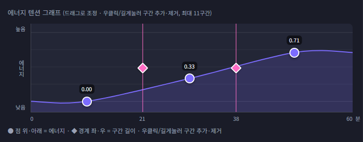

# 추가실험

에너지 텐션의 세부적인 설정을 위한 추가 실험을 제안함. 각각 실험 항목에 대해 구현한 방법을 통해 나온 결과물이 사용자의 청취만족감을 극대화할 수 있는지 관찰.

## Expermient 1 : 에너지 제어

### a. 에너지 상승

* 실험방법

1) 아래 그림과 같이 3구간, 총합 30분 설정을 한다. 각 구간은 10분씩이다.

    

1) 시작에너지를 다음과 같이 설정한다.
    - 시작 에너지 = 0.00
    - 시작 에너지 = 0.10
    - 시작 에너지 = 0.20
    - 시작 에너지 = 0.40
    - 시작 에너지 = (뱅드림 전체 mean or median)

2) 끝에너지를 다음과 같이 설정한다.
    - 끝 에너지 = 1.00
    - 끝 에너지 = 0.90
    - 끝 에너지 = 0.80
    - 끝 에너지 = 0.70
    - 끝 에너지 = 0.60
    
3) 중간 단계는 시작과 끝의 평균값으로 설정한다.

4) 플레이리스트를 생성한다.

5) 생성된 플레이리스트를 순서대로 에너지값과 함께 csv로 나열한 후 청취자로 하여금 이 플레이리스트 전체에 대해 1(이 에너지에 동의하지 않음)~5(이 에너지가 매우 어울림)을 평가하도록 한다.

6) 1) ~ 5)를 N회 반복한다.

### b. 에너지 하강

* 실험방법

1) 아래 그림과 같이 3구간, 총합 30분 설정을 한다. 각 구간은 10분씩이다.

    

1) 시작에너지를 다음과 같이 설정한다.
    - 시작 에너지 = 1.00
    - 시작 에너지 = 0.90
    - 시작 에너지 = 0.80
    - 시작 에너지 = 0.70
    - 시작 에너지 = (뱅드림 전체 mean or median)

2) 끝에너지를 다음과 같이 설정한다.
    - 끝 에너지 = 0.00
    - 끝 에너지 = 0.10
    - 끝 에너지 = 0.20
    - 끝 에너지 = 0.30
    - 끝 에너지 = 0.40
    
3) 중간 단계는 시작과 끝의 평균값으로 설정한다.

4) 플레이리스트를 생성한다.

5) 생성된 플레이리스트를 순서대로 에너지값과 함께 csv로 나열한 후 청취자로 하여금 이 플레이리스트 전체에 대해 1(이 에너지에 동의하지 않음)~5(이 에너지가 매우 어울림)을 평가하도록 한다.

6) 1) ~ 5)를 N회 반복한다.

