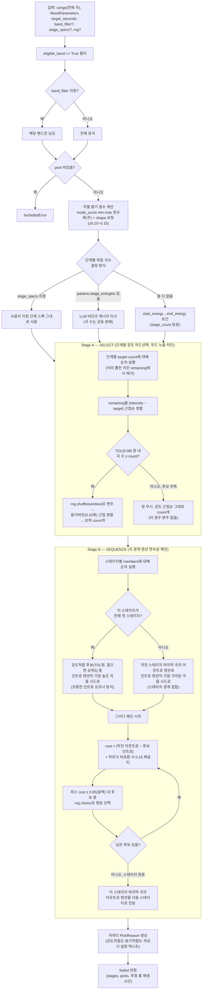

```mermaid
flowchart TD
    IN["입력: songs(전체 곡), MoodParameters,<br/>target_seconds, band_filter?, stage_specs?, rng?"]
    IN --> POOL["eligible_band == True 필터"]
    POOL --> BF{"band_filter 지정?"}
    BF -->|예| POOLB["해당 밴드만 남김"]
    BF -->|아니오| POOLA["전체 유지"]
    POOLB --> EMPTY{"pool 비었음?"}
    POOLA --> EMPTY
    EMPTY -->|예| ERR["NoSetlistError"]
    EMPTY -->|아니오| BRIGHT["곡별 밝기 점수 계산<br/>mode_score min-max 정규화(주) + shape 보정(±0.10~0.15)"]

    BRIGHT --> TCHOICE{"단계별 목표·곡수<br/>결정 방식"}
    TCHOICE -->|"stage_specs 지정"| T1["사용자 지정 단계 스펙 그대로 사용"]
    TCHOICE -->|"params.stage_energies 있음"| T2["LLM 비단조 에너지 아크<br/>(곡 수는 균등 분배)"]
    TCHOICE -->|"둘 다 없음"| T3["start_energy→end_energy 보간<br/>(stage_count 등분)"]

    T1 --> STAGEA
    T2 --> STAGEA
    T3 --> STAGEA

    subgraph STAGEA["Stage A — SELECT (단계별 강도 하드선택, 무드 누출 차단)"]
        direction TB
        SA0["단계별 target·count에 대해 순차 실행<br/>(이미 뽑힌 곡은 remaining에서 제거)"]
        SA0 --> SA1["remaining을 |intensity − target| 근접순 정렬"]
        SA1 --> SA2{"TOL(0.08) 창 내<br/>곡 수 ≥ count?"}
        SA2 -->|예| SA3["rng.shuffle(window)로 변주 →<br/>밝기버킷(0.25폭) 근접 정렬 → 상위 count개"]
        SA2 -->|아니오, 후보 부족| SA4["창 무시, 강도 근접순 그대로 count개<br/>(이 경우 변주 없음)"]
    end

    STAGEA --> STAGEB

    subgraph STAGEB["Stage B — SEQUENCE (곡 경계 텐션 연속성 체인)"]
        direction TB
        SB0["스테이지별 members에 대해 순차 실행"]
        SB0 --> SB1{"이 스테이지가<br/>전체 첫 스테이지?"}
        SB1 -->|예| SB2["강도적합 후보(TOL창, 없으면 상위5) 중<br/>인트로 텐션이 가장 높은 곡을 시드로<br/>(조용한 인트로 오프너 방지)"]
        SB1 -->|아니오| SB3["직전 스테이지 마지막 곡의 아웃트로 텐션과<br/>인트로 텐션이 가장 가까운 곡을 시드로<br/>(스테이지 경계 접합)"]
        SB2 --> SB4
        SB3 --> SB4["그리디 체인 시작"]
        SB4 --> SB5["cost = |직전 아웃트로 − 후보 인트로|<br/>+ 하모닉 비호환 시 0.15 페널티"]
        SB5 --> SB6["최소 cost ± 0.05(슬랙) 내 후보 중<br/>rng.choice로 랜덤 선택"]
        SB6 --> SB7{"남은 후보 있음?"}
        SB7 -->|예| SB5
        SB7 -->|아니오, 스테이지 완료| SB8["이 스테이지 마지막 곡의<br/>아웃트로 텐션을 다음 스테이지로 전달"]
    end

    STAGEB --> REASON["곡마다 PickReason 생성<br/>(강도적합도·밝기적합도·하모닉 설명 텍스트)"]
    REASON --> OUT["Setlist 반환<br/>(stages, picks, 추정 총 재생시간)"]
```