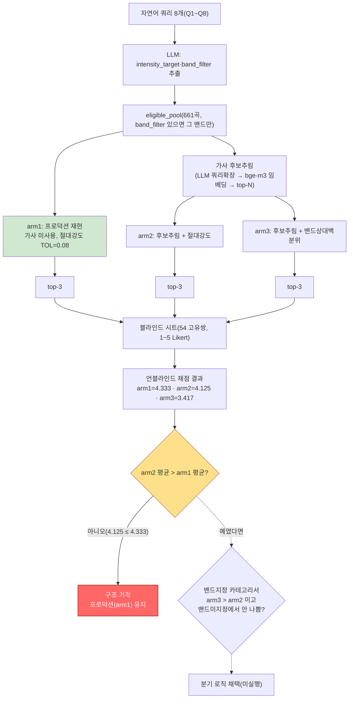

# 선곡 파이프라인 3-way 비교 — 결과 보고서

> 설계: `topic/selection_pipeline/DESIGN.md`(사전 등록). 블라인드 채점(1~5 Likert, `random.Random(20260717)`
> 셔플) 54개 고유 (쿼리, 곡) 쌍, 연구자 1인, 2026-07-18 완료.

## 0. 사전등록 판정 결과 — **구조 기각(프로덕션 유지)**

| arm | 전체 평균 | n(고유 채점 수, 중복 arm 소속 포함) |
|---|---|---|
| **arm1**(프로덕션 재현, 가사 미사용) | **4.333** | 24 |
| arm2(가사 후보추림 + 절대강도) | 4.125 | 24 |
| arm3(가사 후보추림 + 밴드상대백분위) | 3.417 | 24 |

DESIGN.md §0 판정표: "구조 채택" 조건은 **arm2 평균 > arm1 평균**. 실측은 arm2(4.125) ≤ arm1(4.333)
→ **구조 기각**. 사전등록 규칙에 따라 이 경우 **arm3 성적과 무관하게 가사 후보추림 자체를 보류**한다
(arm3 판정은 형식적으로 무의미하나, 아래에서 참고용으로 원인 분석에는 활용한다).

**결론: 가사 임베딩 기반 후보 추림 구조도, 밴드 상대 백분위 강도 해석도 프로덕션(현행 절대강도
매칭) 대비 개선을 보이지 않았다. `selection.py`는 현행 로직을 유지한다.**

### 0.1 파이프라인 구조 및 판정 흐름도

> 점선 화살표(D1→D2, D2→분기채택)는 **실제로 도달하지 않은 경로**다 — arm2가 arm1을 못 넘어서
> §0 사전등록 규칙에 따라 arm3 판정 자체가 형식적으로 생략됐다(빨간 박스가 실제 도달한 결론).

## 1. 카테고리별 세부 (탐색적 — 판정에는 영향 없음, 사전등록 규칙 그대로 적용됨)

| 카테고리 | arm1 | arm2 | arm3 | 사전 예측 | 실측과 일치? |
|---|---|---|---|---|---|
| 밴드지정+상대감성(Q1,Q2) | 4.333 | 3.833 | 3.333 | arm3 > arm2 ≥ arm1 | **반대** — arm1이 최고 |
| 밴드미지정+절대강도(Q3,Q4) | 4.833 | 4.333 | 4.000 | arm1·arm2 ≥ arm3 | **일치** |
| 상황/기능성(Q5,Q6) | 4.000 | 4.667 | 3.667 | 예측 없음(탐색) | arm2가 최고 — 유일하게 가사 후보추림이 도움된 카테고리 |
| 밝기재확인(Q7,Q8) | 4.167 | 3.667 | 2.667 | 예측 없음(탐색) | arm1이 최고, arm3 급락 |

**밴드지정+상대감성(Q1,Q2)에서 예측이 정반대로 뒤집힌 것이 가장 중요한 발견**이다. report/05가 제안한
"밴드 명시 시 상대 백분위가 유리하다"는 가설이 실측에서 기각됐다 — 오히려 arm3가 가장 낮았다(Q2에서
특히, 2.000점).

## 2. 원인 분석 — 코멘트 기반 (사전등록 후 발견, 판정 변경 아님)

### 2a. 인트로 오인 — 데이터 아티팩트 의심
Q2(raise_a_suilen 차분한 곡) 저점 3건 중 2건에 "인트로 오인" 코멘트가 명시됨:
- `raise_a_suilen__521` (ゆら・ゆらRing-Dong-Dance, arm2, 1점): "인트로 소개 멘트 때문에 오인했다고
  생각됨. 실제론 차분한 곡이 아님."
- `raise_a_suilen__522` (Hey-day狂騒曲, arm3, 1점): "인트로 오인."
- `raise_a_suilen__542` (RUNAWAY STAR, arm3, 1점): "질주감이 꽤 있는 노래임."

같은 곡(`raise_a_suilen__521`)이 arm2·arm3 양쪽에서 낮은 강도로 잘못 뽑힌 것은, 이 곡들의 `intensity`
값 자체가 실제 곡 전체 인상과 어긋난다는 뜻일 수 있다 — 곡 도입부(멘트·페이드인 등)가 전체 강도
집계에 과도하게 영향을 줬을 가능성. **이는 이 연구의 arm 설계 문제가 아니라 상류 음향 특징 추출
단계의 잠재적 데이터 품질 이슈** — 별도로 짚어둘 가치가 있으나 이번 연구의 판정을 바꾸지 않는다.

### 2b. 밝기(valence) 불일치 — 기존 병목의 재확인
Q8(마음이 무겁고 가라앉는 밤) arm3가 유독 낮음(1.333) — 저점 3곡 모두 밝고 활기찬 곡이 뽑힘:
- `poppin_party__447` "START!! True dreams"(1점): "매우 밝고 희망찬 노래."
- `raise_a_suilen__560` "Just Awake (Cover)"(1점): "위와 같음."
- `mygo__278` "処救生"(2점): "질주감이 있는 노래... 곡조 때문에 안맞는 느낌."

이는 `topic/vector-embedding/report/04-lyrics_acoustic_fusion.md`·[[vector-embedding-phase2-status]]가
이미 확인한 바(강도(intensity)는 텐션이지 valence가 아니다, 이 카탈로그엔 검증된 valence 축이 없다)와
정확히 같은 병목이다 — 가사 후보추림(arm2/3)이 여전히 valence를 못 잡고, 밴드 상대 백분위(arm3)로
바꾼다고 이 문제가 해소되지 않는다는 것을 재확인한 셈이다.

### 2c. 유일한 예외 — 상황/기능성 쿼리에서 arm2 우위
Q5("운동할 때 들으면 힘 나는 노래") arm2 평균 5.0(만점) — `raise_a_suilen__533`·`raise_a_suilen__490`
둘 다 5점("운동할 때 진짜로 도파민이 샘솟는", "정말로 힘날듯"). 가사 후보추림이 "운동"·"힘"과 관련된
가사를 가진 곡으로 후보를 좁힌 것이 실제로 유효했을 가능성 — 다만 n=3/쿼리로 방향성 이상의 결론은
무리다.

## 3. 전반적 품질 평가 (연구자 의견)

3개 arm 평균 모두 3.4~4.3(5점 만점)으로 전반적으로 준수하다 — Phase 1·2의 0~10 척도 대비(4.67~5.17/10)
체감상 개선된 편이나, 척도 자체가 다르고(1~5 vs 0~10) 쿼리·카탈로그가 달라 직접 비교는 어렵다.
저점 사례는 대부분 (a) 인트로 아티팩트 또는 (b) valence 불일치라는 이미 알려진/설명 가능한 원인으로
귀결되며, "설명 안 되는 무작위 실패"는 관찰되지 않았다.

## 4. 한계 (DESIGN.md §0 사전 선언, 그대로 유지)

- 쿼리 8개·평가자 1인 → 방향성 탐색이며 확증이 아니다.
- candidate_pool 크기 N(20%, 최소 15)은 사전 고정값이며 이 결과를 이유로 사후 조정하지 않는다.
- Stage B(하모닉 시퀀싱)는 범위 밖 — 이 결과는 SELECT 단계 비교에 한정된다.

## 5. 권고

1. **`selection.py`의 후보추림/밴드상대백분위 도입은 보류** — 사전등록 판정에 따라 프로덕션 로직
   변경 없음.
2. **인트로 아티팩트 의심 곡**(`raise_a_suilen__521`, `raise_a_suilen__522` 등 raise_a_suilen에
   멘트/도입부가 있는 곡들)은 음향 특징 추출 파이프라인 쪽에서 별도로 QA할 가치가 있다 — 이 연구의
   범위는 아니다.
3. valence 축 부재는 여전히 이 카탈로그의 근본 병목 — `mood_warmth` 트랙(현재 종결 상태,
   [[mood-warmth-research-status]])의 재개 여부는 별개로 사용자 판단이 필요하다.

---

## 6. 추가 검토 — 인트로 오인 제외 재계산 + arm 스위칭 제안 (2026-07-18, 사후 논의)

> **주의**: 아래는 §0의 사전등록 판정을 뒤집는 것이 아니다 — DESIGN.md의 판정 기준·데이터는
> 그대로 유지되며, 이 절은 채점 완료 후 연구자와의 논의에서 나온 **참고용 재분석 + 후속 제안**이다.

### 6.1 인트로 오인 의심 2건 제외 후 재계산

코멘트에서 명시적으로 "인트로 오인"으로 저점을 받은 2건(`raise_a_suilen__521`, arm2, 1점 /
`raise_a_suilen__522`, arm3, 1점 — 강도 데이터가 곡 도입부에 좌우된 것으로 의심되는 상류 데이터
품질 이슈, §2a 참조)을 제외하고 재계산한 결과:

| arm | 원래 평균(n=24) | 제외 후 평균(n=22~23) |
|---|---|---|
| **arm1**(프로덕션) | 4.333 | 4.333 (두 건 다 arm1 소속 아님 — 변화 없음) |
| arm2(가사 후보추림 + 절대강도) | 4.125 | **4.261** |
| arm3(가사 후보추림 + 밴드상대백분위) | 3.417 | **3.522** |

카테고리별로 보면, **밴드지정+상대감성(Q1,Q2)**에서 arm2가 arm1을 근소하게 앞선다(4.400 vs 4.333):

| 카테고리 | arm1 | arm2 | arm3 |
|---|---|---|---|
| 밴드지정+상대감성(Q1,Q2) | 4.333 | **4.400** | 3.800 |
| 밴드미지정+절대강도(Q3,Q4) | 4.833 | 4.333 | 4.000 |
| 상황/기능성(Q5,Q6) | 4.000 | 4.667 | 3.667 |
| 밝기재확인(Q7,Q8) | 4.167 | 3.667 | 2.667 |

arm2 전체 평균(4.261)은 여전히 arm1(4.333)을 넘지 못해 §0의 "구조 기각" 판정 자체는 바뀌지
않지만, 격차는 0.208 → 0.072로 크게 좁혀진다. **연구자 해석(2026-07-18)**: 이 정도 격차면
"기각"이라기보다 arm1·arm2가 거의 동등한 수준이며, 상황(특히 상황/기능성·밴드지정 카테고리)에
따라서는 arm2가 우위라는 평가. arm3(밴드 상대 백분위)는 제외 후에도 전 카테고리에서 최저권으로,
이 아이디어의 기각 결론은 바뀌지 않는다.

### 6.2 제안 — 상황별 arm 스위칭(밴드 지정 여부 기반)

밴드 지정 여부(사용자의 밴드 셀렉터 직접 선택 포함)는 판별이 쉬우므로, "밴드가 지정된 요청은
arm2(가사 후보추림+절대강도) 로직, 아니면 arm1(현행 절대강도 매칭)"처럼 **상황별로 알고리즘을
스위칭하는 방법론**을 현 배포판(`selection.py`)에 도입할 수 있는지 논의됨.

**가능성 평가(구현 전, 타당성만 확인)**:

1. **스위칭 로직 자체는 쉽다.** 프로덕션은 이미 밴드 필터를 프롬프트 자동감지(별명 매칭,
   `8cfe36a`) + 사용자 직접 체크박스 선택(`0e13f72`가 누적 버그를 고친 그 기능) 양쪽으로 갖고
   있어, "band_filter 유무로 arm 분기"라는 조건 자체는 기존 인프라 위에 자연스럽게 얹을 수 있다.
   새 인프라가 필요 없다.
2. **진짜 비용은 arm2(가사 후보추림)를 프로덕션에 들여오는 쪽이다.** 현재 배포된 백엔드는
   가벼운 FastAPI + Groq 호출 정도인데, arm2는 쿼리 확장(LLM 호출 1회 추가) + `BAAI/bge-m3`
   임베딩(무거운 로컬 모델 로드)이 필요하다:
   - Render 무료 티어의 콜드스타트 문제를 악화시킬 수 있음(모델 로딩 시간·메모리).
   - 661곡 전체의 `desc`(가사 요약) 필드를 상시 유지해야 함 — 지금은 연구용 CSV에만 있고,
     신곡 오토로더 파이프라인에 이 생성 단계를 추가해야 함.
   - 곡 쪽 임베딩은 오프라인 사전계산+캐싱, 쿼리만 요청 시 실시간 임베딩하는 방식이면 비용을
     크게 낮출 수 있음(매 요청마다 661곡을 다시 임베딩할 필요 없음).

**결론(가능성만)**: 기술적으로 가능하며, 병목은 스위칭 로직이 아니라 "arm2를 얼마나 가볍게
프로덕션화할 수 있는가"에 있다. 곡 임베딩 사전계산·캐싱 전략이 핵심 설계 포인트가 될 것.
정식 도입 여부·설계서 작성은 사용자 후속 지시 대기.

### 6.3 상황/기능성 쿼리 판별 방법 (후보)

밴드 지정 여부와 별개로, "이 쿼리가 상황/기능성 쿼리인가"를 판별해야 스위칭 기준을 넓힐 수
있다. 후보 3가지(비용 순):

1. **기존 LLM 호출에 필드 하나 추가(권장)** — 프로덕션은 이미 요청마다 mood/energy 추출용 LLM
   호출을 하므로, 그 구조화 출력에 `query_intent`(예: `situational` / `band_relative` / `general`)
   필드만 추가하면 된다. **API 왕복이 늘지 않아 지연시간·비용 부담이 거의 0** — LLM이 "운동할
   때", "공부할 때", "출근길에" 등 패러프레이즈까지 포괄해 분류할 수 있어 일반화도 좋다.
2. **키워드 사전 매칭(경량 폴백)** — "운동"·"공부"·"출근"·"드라이브"·"잠들 때" 등 상황어
   목록으로 substring 매칭. LLM 호출 불필요라 제일 싸지만, 목록에 없는 표현(예: "땀 흘릴 때")은
   놓친다 — 1번의 보조/폴백 용도로만 적합.
3. **임베딩 유사도(비권장)** — 상황 예시 쿼리들과의 유사도 비교. 이 목적만 위해 arm2가 이미
   안고 있는 임베딩 인프라 비용(§6.2)을 별도로 또 지는 셈이라 과함.

**결론**: 1번(기존 LLM 호출 확장)이 비용 대비 가장 합리적 — §6.2가 지적한 "arm2 프로덕션화
비용"과 겹치지 않는 별개의 저비용 판별 방법이다.

### 6.4 밴드 지정 여부만으로는 부족 — 상황/기능성 카테고리가 더 큰 신호

카테고리별 격차를 다시 보면, arm2가 arm1을 가장 크게 앞서는 곳은 밴드지정 카테고리(+0.067,
인트로 오인 제외 후)가 아니라 **상황/기능성(Q5,Q6)**이다(+0.667 — 이번 실험에서 가장 큰 정
방향 격차):

| 카테고리 | arm1 | arm2(인트로 오인 제외) | 격차(arm2−arm1) |
|---|---|---|---|
| 밴드지정+상대감성(Q1,Q2) | 4.333 | 4.400 | +0.067 |
| 밴드미지정+절대강도(Q3,Q4) | 4.833 | 4.333 | −0.500 |
| **상황/기능성(Q5,Q6)** | **4.000** | **4.667** | **+0.667** |
| 밝기재확인(Q7,Q8) | 4.167 | 3.667 | −0.500 |

Q5("운동할 때 들으면 힘 나는 노래")는 arm2가 5.0 만점 — 가사에 "운동/힘"과 직결된 단어가 있는
곡으로 후보를 좁힌 것이 직접 유효했던 사례. **밴드 지정 여부는 이 이득과 무관한 축이라**, §6.2의
"밴드 지정 시에만 arm2로 스위칭" 제안만으로는 이 카테고리의 이득을 살리지 못한다. 만약 arm
스위칭을 실제로 설계한다면, 판별 기준을 밴드 지정 여부 하나가 아니라 **"쿼리에 상황/목적 키워드가
뚜렷한가"**까지 포함하는 쪽으로 넓혀야 이 신호를 놓치지 않는다 — 다만 이 판별 자체가 밴드
지정 여부보다 판별 난이도가 높다(LLM 분류가 필요할 가능성). n=3/쿼리라 방향성 수준의 관찰이며,
정식 도입 전에는 더 많은 상황/기능성 쿼리로 재검증이 필요하다.
