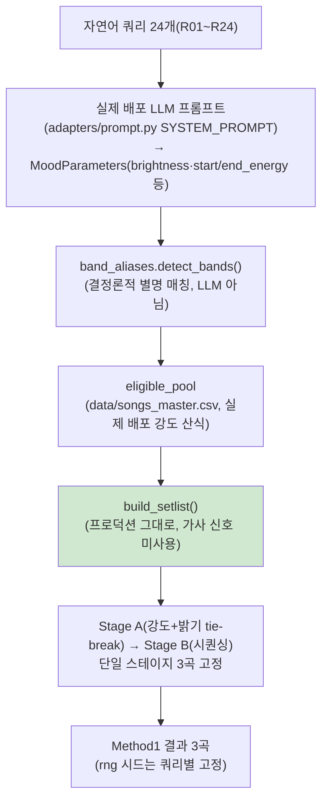
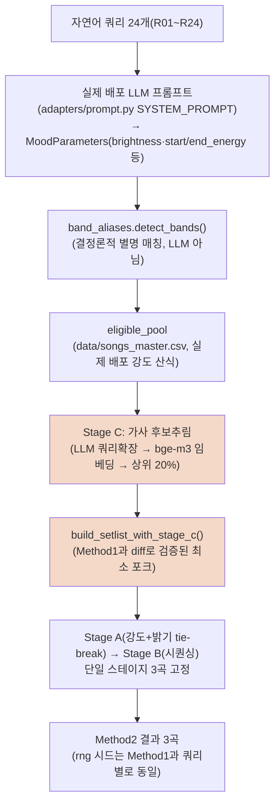
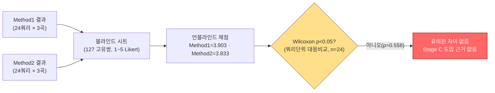
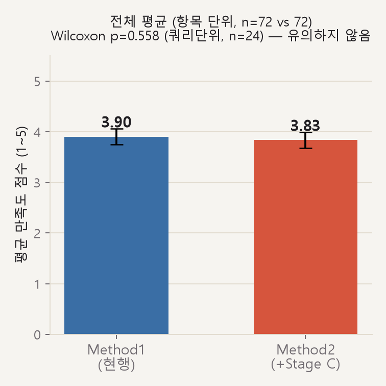
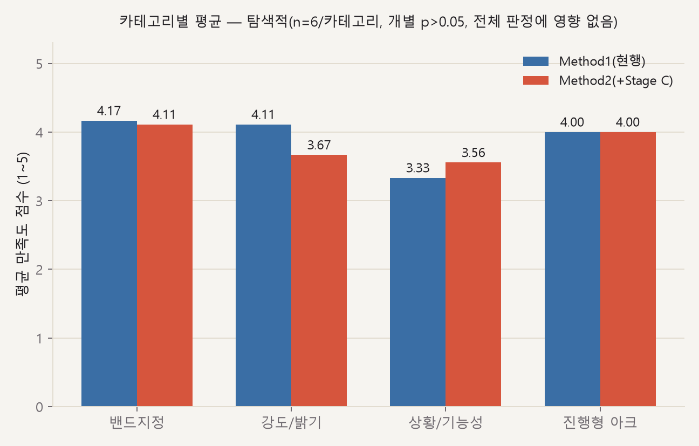
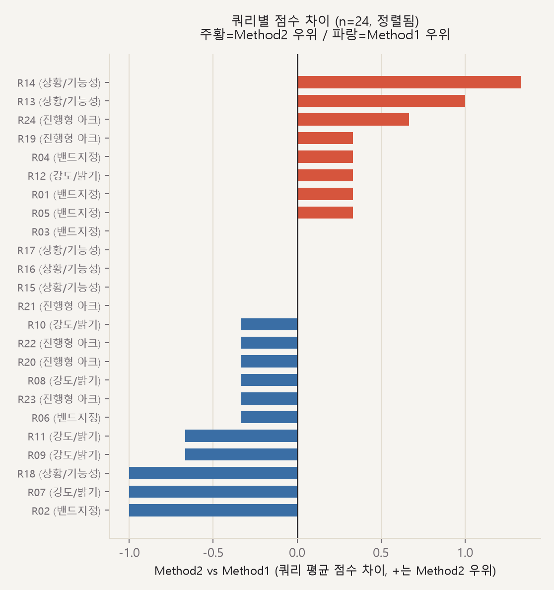

# 선곡 파이프라인 v3 — Method 1(프로덕션) vs Method 2(+ Stage C) 실측 비교 결과

> 설계: `topic/selection_pipeline/DESIGN_v3.md`(사전 등록). v1·v2와 달리 **실제 프로덕션 코드
> 재사용**(`origin/main` 커밋 `5d55187`의 `build_setlist()` 등을 그대로 vendoring)으로 처음부터
> 다시 설계한 독립 실험. 24쿼리 × 단일 스테이지 3곡 고정, 블라인드 1~5 Likert, 실제 고유 127쌍,
> 연구자 1인, 2026-07-18 완료.

## 0.1 실험 구조

### Method 1 — 현재 프로덕션 그대로

### Method 2 — Stage C(가사 후보추림) 삽입판

### 비교·판정

## 0. 결과 — **유의한 차이 없음, 방향은 오히려 Method1(현행) 쪽**

| method | 평균(항목 단위, n=72) |
|---|---|
| **Method 1**(현행 프로덕션 그대로) | **3.903** |
| Method 2(Stage C 삽입) | 3.833 |

**쿼리 단위 대응비교(n=24쌍, 사전등록 판정 기준)**
- Wilcoxon signed-rank: W = 80.5, **p = 0.558**
- Paired t-test: t = 0.569, p = 0.575
- 평균 차이(Method2−Method1) = **−0.069**, dz = −0.116(매우 작음)
- 방향: Method2 우위 8쌍, Method1 우위 11쌍, 동점 5쌍

**항목 단위(독립표본, n=72 vs 72)**
- Mann-Whitney U = 2687.0, p = 0.686
- Welch's t: t = 0.320, p = 0.749
- Cohen's d(Method2−Method1) = −0.053(거의 0)

DESIGN_v3.md §0 판정 기준(대응비교 p<0.05)을 충족하지 못했고, 조건 (a)(Method2 평균 우위)조차
충족하지 않는다 — **Stage C 삽입이 실제 프로덕션 파이프라인에서 개선을 가져온다는 근거가 전혀
없다.** 오히려 명목상으로는 Method1(가사 미사용, 현행)이 근소 우위다.

## 1. 검정력 — 이 효과크기라면 근본적으로 무의미한 규모의 표본이 필요

관측 dz=−0.116(매우 작음) 기준, 80% 검정력에 필요한 n은 **583쿼리**(n=24에서 실제 검정력 8.5%).
이 정도로 작은 효과는 통계적으로 "차이가 있는데 못 잡았다"기보다 **"차이가 사실상 없다"**로
해석하는 게 합리적이다 — 필요 n(583)이 비현실적인 규모라는 것 자체가, 설령 진짜 미세한 차이가
있더라도 실사용에서 체감 가능한 수준이 아님을 시사한다.

## 2. 카테고리별 세부 (탐색적 — 전체 판정에는 영향 없음, 사전등록 규칙 그대로 적용됨)

| 카테고리 | Method1 | Method2 | 격차(M2−M1) | dz | Wilcoxon p(n=6) |
|---|---|---|---|---|---|
| 밴드지정(R01~R06) | 4.167 | 4.111 | −0.056 | −0.104 | 0.938 |
| 강도/밝기(R07~R12) | 4.111 | 3.667 | **−0.444** | −0.976(큼) | 0.094 |
| 상황/기능성(R13~R18) | 3.333 | 3.556 | **+0.222** | 0.266 | 0.750 |
| 진행형 아크(R19~R24) | 4.000 | 4.000 | 0.000 | 0.000 | 0.875 |

**개별 카테고리 중 어느 것도 p<0.05를 넘지 못한다.** n=6짜리 대응비교는 6쌍 전부 같은 방향으로
쏠려도 양측 p의 이론적 최솟값이 약 0.031이라, 이 규모로는 애초에 유의성 문턱을 넘기 구조적으로
어렵다 — 강도/밝기 카테고리의 dz≈1.0(명목상 큰 효과)도 p=0.094로 문턱을 못 넘었다. **이 세부
분류는 원 판정(§0)에 영향을 주지 않는 사후 탐색**이다.

다만 방향성 자체는 눈여겨볼 만하다: **상황/기능성 쿼리에서 Method2(가사 후보추림)가 유리하고,
강도/밝기 절대 표현 쿼리에서는 불리**하다는 패턴이 `report/01-*.md` §2c(v1)·`report/01-*.md`
§6.4(v2 사후분석)에 이어 **이번 v3에서도 세 번째로 같은 모양으로 재현**됐다. 서로 완전히 다른
방법론(단순재현→확장재현→실제 프로덕션 코드) 세 라운드에서 방향이 흔들리지 않았다는 점은
정성적으로는 흥미롭지만, 정식 통계 검증(예: 카테고리당 n=20~30 표적 재검증)을 거친 적은 없다 —
"우연으로 치부하기엔 계속 같은 모양으로 나온다" 정도로만 기록해둔다. 상황/기능성 쿼리에서
Method2가 잘 맞은 이유는 가사에 "운동/독서" 같은 상황어가 직접 있어서로 보이고, 강도/밝기
쿼리에서 불리한 이유는 "조용함/밝음" 자체를 가사가 표현하는 경우가 적어 후보추림이 관련
없는 곡을 걸러내기보다 관련 있는(그러나 강도가 안 맞는) 곡을 잘못 끌어오기 때문으로 보인다.

## 3. 특이 케이스 (코멘트 기반, 판정 변경 아님)

### 3a. R01 — 밴드 필터가 아예 안 걸린 케이스 (아포스트로피 매칭 실패)
"**poppin'party** 노래로 신나게 하루 시작하고 싶어"인데 `band_filter`가 빈 값으로 추출돼,
raise_a_suilen·hello_happy_world·pastel_palettes 등 엉뚱한 밴드 곡이 섞여 나왔다(채점자 코멘트:
"이거는 RAS 노래야. 잘못 골랐어" 1점, "HHW의 노래임" 1점, "pastel palette 곡을 가져옴" 1점).
원인: `band_aliases.py`의 별명 목록엔 `"poppin_party"`·`"poppin party"`만 있고 아포스트로피가
들어간 `"poppin'party"`는 부분 문자열로 안 걸린다 — 쿼리 표기(아포스트로피 포함 밴드 표기)가
결정론적 매칭기의 사각지대와 만난 사례다. R19(아래 §3b)와 정반대 방향(과소 매칭)의 케이스.

### 3b. R19 — 반대로 과다 매칭된 케이스 (부수 발견, DESIGN_v3.md §8 기재)
"달리기 준비운동부터 본운동, 마무리까지 이어지는 러닝 **플레이리스트**"의 "플레이리스트" 안
"레이" 부분 문자열이 `raise_a_suilen`의 짧은 별명("레이")과 우연히 매칭돼 `band_filter`가
의도치 않게 `raise_a_suilen`으로 좁혀졌다. `band_aliases.py` 자체가 이미 알고 있는 트레이드오프
(짧은 별명의 오탐 가능성)이며, 이번 실험이 만든 버그는 아니다. Method1·2 둘 다 동일하게
영향받아 비교 공정성 자체는 유지된다.

### 3c. R24 — 사전 등록된 실험 설계 한계(DESIGN_v3.md §7)가 실측으로 확인된 케이스
"운동 마무리하고 차분히 식히는 **쿨다운**" 요청이 전체 24쿼리 중 **최저 점수**를 받았다
(Method1 평균 1.667, Method2 평균 2.333). 원인 확인: LLM은 `start_energy=0.6 → end_energy=0.2`로
하강 아크를 정확히 잡았는데, 이 실험은 "쿼리당 고정 3곡" 통제를 위해 **`start_energy`(0.6)만
단일 스테이지 목표로 쓰고 하강 아크 자체를 버리는** 설계였다(DESIGN_v3.md §4에서 사전에 명시한
정보 손실). 그 결과 실제로는 준비운동~본운동에 가까운 텐션 높은 곡들이 나왔고, 채점자 코멘트가
전부 "웜업/스퍼트/히트업 느낌"이었다. **이건 Method1 vs Method2의 차이가 아니라, 이 실험의
"고정 n곡" 단순화 자체가 실측으로 대가를 치른 사례**다 — 다음에 진행형 아크 쿼리를 다시 다룬다면
단일 스테이지 강제를 재고할 필요가 있다.

### 3d. R07 — valence(성격) 불일치 재확인
Method1이 고른 "Sage der Rosen"(roselia, 1점): 채점자 코멘트 "오페라 코러스가 풍부한 노래.
웅장하고 서사적인 느낌이 지배적" — 측정된 강도(intensity)는 "완전 조용하고 힘 빠진" 목표에
근접했지만, 곡의 성격 자체가 요청과 거리가 멀었다. `report/01-*.md` §2b·[[vector-embedding-phase2-status]]가
이미 지적한 "이 카탈로그엔 검증된 valence 축이 없다"는 병목과 동일한 유형의 사례.

### 3e. R03 — 모델링 문제 아닌 참고 사례
"raise a suilen 노래로 미친듯이 달리고 싶어" 요청에 뽑힌 "Hey-day狂騒曲(カプリチオ)"에 채점자가
남긴 코멘트: "RAS인 것도 맞고 달리는 느낌도 맞지만, 이 곡은 afterglow의 원곡임 — RAS가 활동 전에
부른 특수한 상황의 곡". 밴드 태그·선곡 로직 자체는 정상 동작(`band` 컬럼 기준으로는 RAS 소속이
맞음) — 카탈로그 메타데이터의 뉘앙스(커버 이력)를 다 담지 못하는 것뿐, 버그는 아니다.

## 4. 이 결과가 v1·v2보다 신뢰할 수 있는 이유

- **실제 프로덕션 코드를 그대로 재사용**했다(`build_setlist()` import, `selection_stage_c.py`는
  diff로 검증된 최소 변경). v1·v2는 강도창 로직만 단순 재현하고 밝기 tie-break·Stage B 시퀀싱을
  생략했었다(`report/01-*.md` 참조) — 그래서 "실제 프로덕션 대비 개선 여부"에 답하지 못했다.
- **실제 배포 데이터**(`data/songs_master.csv`, energy_full+acousticness+시간분절 강도의 검증된
  결합 신호)를 썼다 — v1·v2가 썼던 연구용 `song_acoustics.csv`가 아니다.
- **실제 배포 LLM 프롬프트**(`adapters/prompt.py`의 `SYSTEM_PROMPT`)로 `MoodParameters`를
  뽑았다 — v1·v2의 "intensity_target 하나만 추출" 축소판이 아니다.
- **곡 다양성 붕괴가 재발하지 않았다**(method1 고유곡 50/72, method2 52/72) — v2의 핵심 실패
  (`report/02-*.md` §3)가 이번엔 관찰되지 않았다. `MoodParameters`가 다차원이고 Stage B 시퀀싱이
  실제로 작동해 조합에 변주가 생긴 덕으로 보인다.
- 같은 rng 시드를 Method1·Method2에 동일하게 써서, 관측된 차이가 순수하게 Stage C 유무 때문이지
  RNG 노이즈 때문이 아니라고 말할 수 있다.

## 5. 결론 및 권고

1. **`selection.py`에 Stage C(가사 후보추림)를 넣는 안은 채택 근거가 없다.** 프로덕션 코드로
   직접 검증한 결과이므로, v1(구조 기각)·v2(판정 보류)보다 이 결론에 더 큰 무게를 둘 수 있다.
2. 세 번의 독립적 시도(v1 단순재현, v2 확장재현, v3 실코드) **모두 가사 후보추림의 이점을
   입증하지 못했다** — 이제는 "표본이 작아서" "재현이 부실해서"라는 변명이 남아있지 않다. 이
   아이디어는 **최종적으로 폐기**하는 것을 권고한다.
3. 다음 개선 축을 찾는다면, 이 카탈로그의 알려진 근본 병목인 **valence(밝기) 축의 신뢰도**
   쪽을 우선 검토하는 게 낫다 — `report/01-*.md` §2b, [[vector-embedding-phase2-status]],
   [[mood-warmth-research-status]] 참조. Stage C 계열 아이디어(가사 신호 활용)는 이 세 라운드로
   충분히 검증됐다고 본다.
