# Appendix — 현재 배포판(`build_setlist`) 실제 파이프라인 다이어그램

> 출처: `src/backend/app/domain/selection.py`(`origin/main` 기준, 270줄). 이 문서의 본편(§0~§7,
> `report/01-*.md`·`report/02-*.md`)이 비교한 arm1은 이 함수의 **Stage A(강도창 로직)만** 단순
> 재현한 것이고, 밝기버킷 tie-break와 Stage B(시퀀싱) 전체는 DESIGN.md §0 한계에서 명시적으로
> 범위 밖에 뒀다 — 즉 연구에서 쓴 "arm1"과 아래 실제 배포판은 **같은 함수가 아니라 그 일부만
> 재현한 것**이다. 가사 후보추림(arm2/3)은 이 함수 어디에도 없다 — 프로덕션에 병합된 적 없다.

## 전체 흐름

```mermaid
flowchart TD
    IN["입력: songs(전체 곡), MoodParameters,<br/>target_seconds, band_filter?, stage_specs?, rng?"]
    IN --> POOL["eligible_band == True 필터"]
    POOL --> BF{"band_filter 지정?"}
    BF -->|예| POOLB["해당 밴드만 남김"]
    BF -->|아니오| POOLA["전체 유지"]
    POOLB --> EMPTY{"pool 비었음?"}
    POOLA --> EMPTY
    EMPTY -->|예| ERR["NoSetlistError"]
    EMPTY -->|아니오| BRIGHT["곡별 밝기 점수 계산<br/>mode_score min-max 정규화(주) + shape 보정(±0.10~0.15)"]

    BRIGHT --> TCHOICE{"단계별 목표·곡수<br/>결정 방식"}
    TCHOICE -->|"stage_specs 지정"| T1["사용자 지정 단계 스펙 그대로 사용"]
    TCHOICE -->|"params.stage_energies 있음"| T2["LLM 비단조 에너지 아크<br/>(곡 수는 균등 분배)"]
    TCHOICE -->|"둘 다 없음"| T3["start_energy→end_energy 보간<br/>(stage_count 등분)"]

    T1 --> STAGEA
    T2 --> STAGEA
    T3 --> STAGEA

    subgraph STAGEA["Stage A — SELECT (단계별 강도 하드선택, 무드 누출 차단)"]
        direction TB
        SA0["단계별 target·count에 대해 순차 실행<br/>(이미 뽑힌 곡은 remaining에서 제거)"]
        SA0 --> SA1["remaining을 |intensity − target| 근접순 정렬"]
        SA1 --> SA2{"TOL(0.08) 창 내<br/>곡 수 ≥ count?"}
        SA2 -->|예| SA3["rng.shuffle(window)로 변주 →<br/>밝기버킷(0.25폭) 근접 정렬 → 상위 count개"]
        SA2 -->|아니오, 후보 부족| SA4["창 무시, 강도 근접순 그대로 count개<br/>(이 경우 변주 없음)"]
    end

    STAGEA --> STAGEB

    subgraph STAGEB["Stage B — SEQUENCE (곡 경계 텐션 연속성 체인)"]
        direction TB
        SB0["스테이지별 members에 대해 순차 실행"]
        SB0 --> SB1{"이 스테이지가<br/>전체 첫 스테이지?"}
        SB1 -->|예| SB2["강도적합 후보(TOL창, 없으면 상위5) 중<br/>인트로 텐션이 가장 높은 곡을 시드로<br/>(조용한 인트로 오프너 방지)"]
        SB1 -->|아니오| SB3["직전 스테이지 마지막 곡의 아웃트로 텐션과<br/>인트로 텐션이 가장 가까운 곡을 시드로<br/>(스테이지 경계 접합)"]
        SB2 --> SB4
        SB3 --> SB4["그리디 체인 시작"]
        SB4 --> SB5["cost = |직전 아웃트로 − 후보 인트로|<br/>+ 하모닉 비호환 시 0.15 페널티"]
        SB5 --> SB6["최소 cost ± 0.05(슬랙) 내 후보 중<br/>rng.choice로 랜덤 선택"]
        SB6 --> SB7{"남은 후보 있음?"}
        SB7 -->|예| SB5
        SB7 -->|아니오, 스테이지 완료| SB8["이 스테이지 마지막 곡의<br/>아웃트로 텐션을 다음 스테이지로 전달"]
    end

    STAGEB --> REASON["곡마다 PickReason 생성<br/>(강도적합도·밝기적합도·하모닉 설명 텍스트)"]
    REASON --> OUT["Setlist 반환<br/>(stages, picks, 추정 총 재생시간)"]
```

## Stage A 요약 (강도 하드선택)

| 조건 | 동작 |
|---|---|
| TOL(0.08) 창 안에 곡이 `count`개 이상 | 창 내 곡을 `rng.shuffle` → **밝기 버킷(0.25폭) 근접순**으로 재정렬 → 상위 `count`개 |
| 창 안에 곡이 `count`개 미만(후보 부족) | 창을 무시하고 **강도 근접순 그대로** `count`개(이 경로는 변주 없음) |

- `eligible_band` + `band_filter`만 사전 필터로 적용 — **가사 신호는 전혀 쓰지 않는다**
  (research arm2/3의 "가사 후보추림"은 이 필터 단계에 해당하는 자리지만, 실제로는 존재하지 않음).
- 밝기(`brightness`)는 Stage A의 **강도창 통과 후 tie-break**로만 개입한다 — 강도 자체를 흔들지
  않는다(무드 누출 차단 설계 원칙).

## Stage B 요약 (시퀀싱)

- 목적은 "곡 *내부* 텐션 변화는 정상, 곡 *경계*의 급격한 텐션 단절만 최소화"(§설계 원칙).
- 오프너는 예외적으로 "강도 적합 후보 중 인트로 텐션이 가장 높은 곡"으로 고정 — 조용한 인트로가
  전체 첫 곡이 되는 문제를 피하기 위함.
- 하모닉(카멜롯 조성) 비호환은 완전 배제가 아니라 **비용에 0.15 페널티**로 반영 — 경계 갭이 충분히
  작으면 비하모닉이라도 선택될 수 있음(하드 제약 아님).
- `_RANDOM_SLACK`(0.05) 덕분에 최소 비용 후보 하나로 고정되지 않고, 비슷한 비용대의 후보 중
  랜덤 선택 — 매 호출 다른 시퀀스가 나올 수 있음(재현하려면 `rng` 시드 고정 필요).

## 연구(3-way 비교)와의 관계

- `topic/selection_pipeline/DESIGN.md`의 **arm1**은 위 Stage A의 강도창 로직만 단순 재현했고,
  밝기 버킷 tie-break·Stage B 전체는 명시적으로 범위 밖으로 뺐다(순수 SELECT 단계 비교 목적).
- **arm2·arm3(가사 후보추림)는 위 다이어그램 어디에도 없다** — 실제 `selection.py`에 병합된 적
  없는, 순수 연구용 가상의 대안 구조였다. `report/02-selection_pipeline_v2_replication.md`의
  최종 결론(주제 종결, arm1 유지)에 따라 앞으로도 병합 계획 없음.
