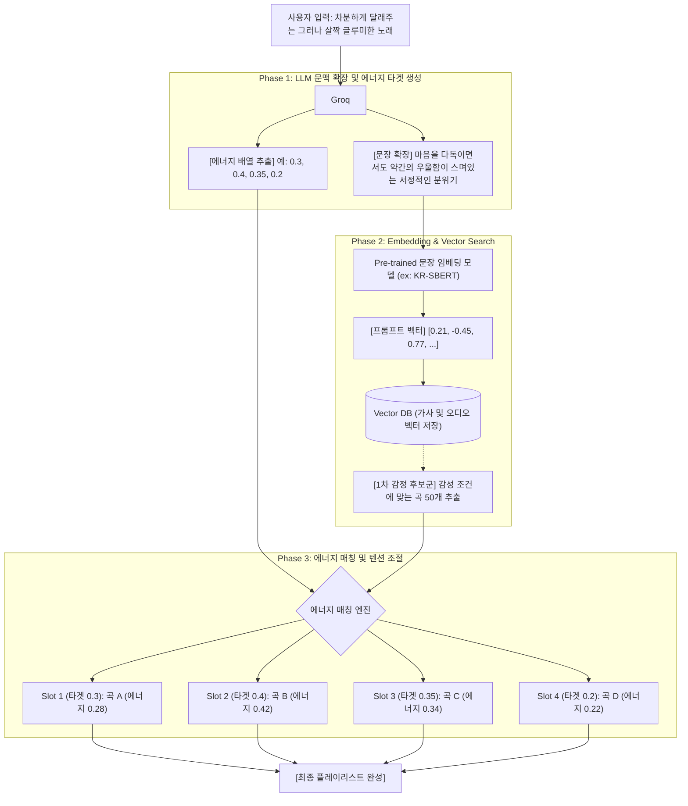

```mermaid
graph TD
    %% User Input
    User["사용자 입력: 차분하게 달래주는 그러나 살짝 글루미한 노래"] --> Groq

    %% Phase 1: LLM Processing
    subgraph Phase1 [Phase 1: LLM 문맥 확장 및 에너지 타겟 생성]
        Groq --> ExpandedText["[문장 확장] 마음을 다독이면서도 약간의 우울함이 스며있는 서정적인 분위기"]
        Groq --> EnergyTarget["[에너지 배열 추출] 예: 0.3, 0.4, 0.35, 0.2"]
    end

    %% Phase 2: Embedding & Vector Search
    ExpandedText --> PreTrainedModel

    subgraph Phase2 [Phase 2: Embedding & Vector Search]
        PreTrainedModel["Pre-trained 문장 임베딩 모델 (ex: KR-SBERT)"] --> Vector["[프롬프트 벡터] [0.21, -0.45, 0.77, ...]"]
        Vector --> VectorDB[("Vector DB (가사 및 오디오 벡터 저장)")]
        VectorDB -.-> Pool["[1차 감정 후보군] 감성 조건에 맞는 곡 50개 추출"]
    end

    %% Phase 3: Energy Matching
    EnergyTarget --> MatchingEngine
    Pool --> MatchingEngine

    subgraph Phase3 [Phase 3: 에너지 매칭 및 텐션 조절]
        MatchingEngine{"에너지 매칭 엔진"}
        MatchingEngine --> Song1["Slot 1 (타겟 0.3): 곡 A (에너지 0.28)"]
        MatchingEngine --> Song2["Slot 2 (타겟 0.4): 곡 B (에너지 0.42)"]
        MatchingEngine --> Song3["Slot 3 (타겟 0.35): 곡 C (에너지 0.34)"]
        MatchingEngine --> Song4["Slot 4 (타겟 0.2): 곡 D (에너지 0.22)"]
    end

    %% Output
    Song1 --> Playlist["[최종 플레이리스트 완성]"]
    Song2 --> Playlist
    Song3 --> Playlist
    Song4 --> Playlist
```